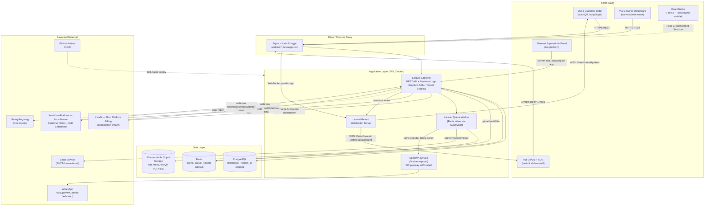

# Dokumen Arsitektur — Sistem POS Multi-Tenant SaaS
**Turunan dari:** PRD-POS-SaaS-v1.5, terutama section 1.3, 2.2–2.3, 7, 8, 9, dan 13.1.
**Status:** Selaras dengan keputusan final v1.5 (semua open question sudah ditutup, lihat section 13 PRD).

---

## 1. Ringkasan & Prinsip Arsitektur

| Prinsip | Penjelasan |
|---|---|
| **Decoupled / API-first** | Laravel jadi satu-satunya sumber business logic, diakses lewat REST API oleh **semua** frontend non-Filament (Vue POS, Vue Owner Dashboard, Vue Customer Order, dan React Native di Fase 2). Filament langsung terhubung ke Laravel/Eloquent tanpa lewat REST API. |
| **Multi-tenant, shared database** | Satu database PostgreSQL, isolasi memakai `tenant_id` scoping (global scope) di semua model — bukan database/schema per tenant (section 2.2). |
| **Stateless backend** | Backend Laravel tidak menyimpan state di local disk/memory instance agar bisa horizontal scale; state session/cache dipusatkan di Redis, file di object storage. |
| **Realtime-first untuk operasional** | Reverb (WebSocket) jadi jalur utama notifikasi order ke Kasir/KDS/Customer, dengan polling sebagai jaring pengaman (bukan pengganti). |
| **No offline mode (MVP)** | Seluruh alur transaksi butuh koneksi internet aktif; offline-first masuk Fase 2. |
| **1 provider pembayaran, 2 akun terpisah** | Xendit dipakai untuk billing platform maupun transaksi customer, tapi lewat **2 akun & 2 endpoint webhook yang terpisah total** — tidak boleh tertukar. |

---

## 2. Diagram Komponen

---

## 3. Lapisan & Teknologi

### 3.1 Client Layer
| Frontend | Stack | Konsumen | Catatan |
|---|---|---|---|
| Vue 3 Customer Order | Vue 3 + Vite | Customer (tanpa akun) | Wajib kompatibel Android WebView 5 tahun terakhir & Safari iOS 2 versi major terakhir (banyak akses dari in-app browser WA) |
| Vue 3 POS & KDS | Vue 3 + Vite | Kasir, Kitchen Staff | 1 aplikasi Vue, KDS adalah route terpisah (`/kds`) di app yang sama; target browser desktop modern saja |
| Vue 3 Owner Dashboard | Vue 3 + Vite | Owner/Admin Tenant | Dibranding sebagai produk SaaS milik tenant, akses via `tenantX.namaapp.com` |
| Filament Superadmin Panel | Filament (PHP, server-rendered) | Tim internal platform | Terhubung langsung ke Eloquent, tidak lewat REST API seperti frontend lain |
| React Native (Fase 2) | React Native | Kasir/Owner mobile | Tinggal konsumsi REST API yang sama karena arsitektur sudah API-first sejak MVP |

### 3.2 Edge Layer
- **Nginx** sebagai reverse proxy + terminasi SSL, dengan **wildcard certificate** (`*.namaapp.com`) via Let's Encrypt agar subdomain tenant baru otomatis ter-cover tanpa provisioning cert manual.
- WebSocket passthrough dikonfigurasi khusus untuk trafik ke Reverb.
- CORS di Laravel memakai **whitelist dinamis berdasarkan subdomain tenant aktif** (bukan hardcode satu domain), karena tiap tenant punya subdomain berbeda.

### 3.3 Application Layer
| Komponen | Teknologi | Fungsi |
|---|---|---|
| Laravel Backend | PHP/Laravel | REST API, business logic, multi-tenancy (global scope `tenant_id`), autentikasi (Sanctum), integrasi Xendit |
| Laravel Reverb | WebSocket server | Broadcast `OrderCreated`, `OrderUpdated`, `OrderStatusUpdated`; perlu strategi scaling Redis pub/sub jika tenant besar |
| Queue Worker | Laravel Queue + Redis driver (via Supervisor) | Webhook processing, generate invoice recurring, kirim notifikasi WA/email, cleanup data tenant churned |
| OpenWA | Node.js service, Docker terpisah | Gateway WA self-hosted (MIT License) khusus notifikasi billing ke owner — dipanggil dari Queue Worker via REST API internal, tidak diekspos publik |

### 3.4 Data Layer
| Komponen | Teknologi | Fungsi |
|---|---|---|
| PostgreSQL | Database utama | Shared DB, isolasi via `tenant_id` scoping; `TIMESTAMP WITH TIME ZONE` disimpan UTC |
| Redis | Cache, queue, pub/sub | Backing untuk Laravel Queue dan scaling Reverb |
| S3-compatible Object Storage | DigitalOcean Spaces / AWS S3 / MinIO | Foto menu (di-resize max 800px, quality 80% sebelum simpan), file QR (PDF/PNG hasil generate) — **wajib object storage, bukan local disk**, karena backend stateless untuk horizontal scaling |

### 3.5 Layanan Eksternal
| Layanan | Fungsi | Catatan Kritis |
|---|---|---|
| Xendit — Akun Platform Billing | Tagih subscription fee ke tenant (signup, upgrade plan) | Credential (`XENDIT_SECRET_KEY`) di `.env` platform. Webhook: `/webhook/xendit/platform-billing` |
| Xendit xenPlatform — Akun Master Customer Order | Terima pembayaran self-order (QRIS/e-wallet/dll), split settlement otomatis ke rekening tenant via `sub_account_id` | **Akun terpisah total** dari Platform Billing meski sama-sama Xendit. Webhook: `/webhook/xendit/customer-order`. Tenant tidak menyimpan credential sendiri |
| OpenWA → WhatsApp | Notifikasi billing (trial habis, overdue, suspended) ke **owner saja**, bukan customer | Nomor dedicated (bukan nomor bisnis utama); Email tetap kanal utama untuk notifikasi kritikal, WA kanal tambahan |
| Email Service | Verifikasi akun, reset password, invoice, notifikasi billing | Kanal utama/fallback yang selalu diandalkan |
| Sentry/Bugsnag | Error tracking backend & frontend | Log terpusat karena backend multi-instance, bukan file log per server |
| GitHub Actions | CI/CD | Pipeline: test (termasuk automated tenant-isolation test) → build → deploy ke staging/production |

> **Peringatan arsitektur penting:** Dua integrasi Xendit di atas **sama provider tapi beda akun, beda tujuan bisnis, dan beda endpoint webhook** — kesalahan menyambungkan webhook/credential yang tertukar berisiko fatal (uang masuk ke akun yang salah). Ini harus jadi perhatian utama saat setup environment (lihat 3.7).

### 3.6 Alur Realtime (Reverb)
| Channel | Tipe | Event | Subscriber |
|---|---|---|---|
| `private-tenant.{tenantId}.outlet.{outletId}.orders` | Private | `OrderCreated`, `OrderUpdated` | Kasir, KDS |
| `private-tenant.{tenantId}.table.{tableCode}` | Private | `OrderStatusUpdated` | Customer (tracking page) |
| `presence-tenant.{tenantId}.outlet.{outletId}.staff` | Presence | staff online/offline | Owner dashboard (opsional) |

- Channel private diautentikasi via broadcasting auth endpoint, wajib validasi `tenant_id` + `outlet_id` di authorization callback (mencegah cross-tenant leakage).
- Customer (tanpa akun) memakai **short-lived signed token** per table session untuk otorisasi channel-nya sendiri.
- **Fallback ketahanan koneksi:** indikator status koneksi (Live/Terputus/Reconnecting) di Kasir & KDS; auto-reconnect bawaan Echo (exponential backoff); **polling ringan tiap 30 detik** sebagai jaring pengaman; saat reconnect, client melakukan 1x fetch ulang state terkini agar konsisten dengan server.

### 3.7 Deployment & Infrastruktur
| Aspek | Keputusan |
|---|---|
| Containerization (dev) | Docker + docker-compose (Laravel, PostgreSQL, Redis, Reverb) untuk konsistensi antar developer |
| Hosting production | **VPS** (DigitalOcean Droplet / Hetzner) — final, dipilih karena lebih murah untuk skala awal dibanding PaaS |
| CI/CD | GitHub Actions — test (PHPUnit + tenant isolation test) → build → deploy |
| Reverse proxy & SSL | Nginx + Let's Encrypt wildcard cert |
| Queue worker | Laravel Queue (Redis driver) via Supervisor |
| WebSocket | Reverb sebagai proses terpisah via Supervisor, di belakang Nginx dengan WS passthrough |
| Object storage | S3-compatible via Laravel Filesystem driver `s3` |
| Environment | Staging & production terpisah, dengan **sandbox/test mode terpisah untuk kedua akun Xendit** khusus staging |
| Backup | Automated daily backup PostgreSQL (retensi ≥7 hari) + backup sebelum tiap migration production |

---

## 4. Autentikasi & Otorisasi

| Aspek | Keputusan |
|---|---|
| Mekanisme utama | **Laravel Sanctum** — mendukung SPA cookie-based auth (Vue Owner/POS/KDS) dan token-based auth (React Native Fase 2) sekaligus |
| Customer (tanpa akun) | Short-lived signed token per table session, bukan Sanctum |
| Kebijakan password | Minimal 8 karakter, kombinasi huruf & angka (validasi backend); hash `bcrypt`; reset password wajib tersedia via email |
| Token expiry | Token Sanctum SPA: mengikuti session cookie (idle timeout 8 jam). Token personal access: berlaku 7 hari, tanpa sliding expiration; `POST /api/auth/refresh` memperpanjang sebelum kedaluwarsa |
| 2FA | **Wajib untuk Owner Tenant & Superadmin** (akses data finansial sensitif); tidak wajib untuk Kasir/Kitchen. TOTP sederhana (Google Authenticator) |
| Sesi Superadmin (Filament) | Token/sesi lebih pendek (±2 jam), auto-logout setelah 30 menit idle, 2FA wajib tanpa opsi skip |
| Reset password | Token berlaku 60 menit, sekali pakai; endpoint `forgot-password` di-rate-limit 3 request/email/jam |
| CORS | Whitelist dinamis berdasarkan subdomain tenant aktif |

---

## 5. Keamanan & Kepatuhan Data

- **Isolasi tenant:** Global scope wajib di semua model Eloquent + automated test khusus tenant-isolation di pipeline CI/CD.
- **Rate limiting:**

| Endpoint | Limit |
|---|---|
| `POST /api/tenant/register` | 5/IP/jam |
| `POST /api/tenant/check-subdomain` | 30/IP/menit |
| `POST /api/orders/*` (submit order) | 10/table_code/menit |
| `POST /api/auth/login` | 5/email/5 menit |
| `POST /api/orders/{id}/refund-request` | 3/order/jam |
| Webhook endpoints | Tidak di-rate-limit (inbound dari Xendit) |

- **Verifikasi webhook Xendit:** header `x-callback-token` dicocokkan exact-match terhadap `XENDIT_PLATFORM_BILLING_CALLBACK_TOKEN` dan `XENDIT_CUSTOMER_ORDER_CALLBACK_TOKEN` (disimpan terpisah di `.env`); request tanpa token cocok ditolak HTTP 401. Endpoint webhook wajib idempotent.
- **Enkripsi data sensitif at-rest:** nomor rekening bank tenant di tabel `tenant_payment_accounts` memakai Laravel Encrypted Casting.
- **Retensi data:** data order & payment disimpan minimal 1 tahun (bisa di-archive setelahnya, tidak dihapus otomatis); data tenant `churned` disimpan 30 hari lalu dihapus permanen oleh scheduled job.
- **Kepatuhan UU PDP:** enkripsi at-rest wajib, tapi **tidak ada pembatasan region hosting** (boleh di luar negeri, termasuk Singapore) selama kepatuhan tetap dipenuhi.
- **Audit trail:** akses data tenant oleh Superadmin untuk keperluan support/debugging wajib tercatat di `AuditLog`.
- **File upload:** foto menu maks 2 MB (`jpg`/`jpeg`/`png`/`webp`, 1 foto/item), logo outlet maks 1 MB (+`svg`); validasi di backend, diproses ulang (resize/compress) sebelum disimpan ke S3.

---

## 6. Ketentuan Teknis Lintas Sistem

| Aspek | Keputusan |
|---|---|
| **Timezone** | Semua timestamp disimpan UTC di database; dikonversi ke timezone outlet (field `timezone` di tabel `Outlet`, default `Asia/Jakarta`) saat ditampilkan/dihitung jatuh tempo billing |
| **Mata uang & angka** | IDR disimpan sebagai integer (bukan sen/desimal); API mengembalikan integer mentah, formatting (`Rp XX.XXX`) dilakukan di frontend |
| **Subdomain tenant** | 3–30 karakter, `a-z`/`0-9`/`-` (tidak diawali/diakhiri hyphen), daftar reserved words disimpan di config, validasi unik real-time |
| **Kompatibilitas browser** | Customer Order: Android WebView 5 tahun terakhir + Safari iOS 2 versi major terakhir. Vue POS/Owner/KDS: browser desktop modern saja |
| **Ketergantungan internet** | Tidak ada mode offline di MVP; koneksi terputus → Kasir/KDS tampilkan error jelas, customer tidak bisa checkout sampai koneksi pulih |

---

## 7. Observability & Ketersediaan

| Aspek | Kebutuhan |
|---|---|
| Error tracking | Sentry/Bugsnag untuk backend Laravel & frontend Vue |
| Logging | Terpusat (bukan file log per server) — konsekuensi dari backend stateless/multi-instance |
| Alerting | Otomatis jika Reverb atau Queue Worker down |
| Uptime target | 99.5% untuk MVP |
| Performa | Halaman Customer Order load < 2 detik di koneksi 4G |

---

## 8. Keputusan Arsitektur Kunci (Ringkasan)

| # | Keputusan | Alasan |
|---|---|---|
| 1 | Shared DB + `tenant_id` scoping, bukan DB/schema per tenant | Paling cepat untuk MVP, cukup aman jika global scope disiplin diterapkan di semua model |
| 2 | Subdomain per tenant, bukan path-based | Lebih profesional untuk produk SaaS yang dibranding ke owner tenant |
| 3 | Object storage sejak MVP, bukan local disk | Konsisten dengan requirement backend stateless untuk horizontal scaling |
| 4 | Vue terpisah dari Filament untuk POS/Owner/Customer | Filament tidak cocok untuk UX realtime (Reverb) yang dibutuhkan POS/KDS/Customer Order |
| 5 | 1 akun Xendit master (xenPlatform) untuk semua tenant, bukan per-tenant credentials | Menghindari friksi onboarding (KYB per tenant bisa makan waktu hari), sejalan dengan filosofi self-service signup |
| 6 | Sanctum, bukan JWT | Mendukung SPA cookie-based auth dan token-based (React Native Fase 2) tanpa ganti mekanisme |
| 7 | VPS, bukan PaaS | Lebih murah untuk skala awal MVP |
| 8 | WA gateway self-hosted (OpenWA), bukan Cloud API resmi Meta | Gratis, tapi berisiko restrict nomor — dimitigasi dengan nomor dedicated + Email sebagai kanal utama |
| 9 | Polling 30 detik sebagai fallback Reverb | Reverb/WebSocket adalah jalur utama, tapi order tidak boleh "hilang" saat koneksi WS terputus sesaat |

---

**Catatan:** Dokumen ini fokus pada arsitektur teknis & infrastruktur. Untuk struktur data detail per entity, lihat dokumen **ERD-POS-SaaS-v1.md**. Acceptance Criteria per fitur disusun terpisah sesuai section 14 PRD.
