# Rancangan ERD — Sistem POS Multi-Tenant SaaS
**Turunan dari:** PRD-POS-SaaS-v1.5, Section 8 (Model Data Tingkat Tinggi) + detail teknis tersebar di section 2, 3, 5, 6, dan 13.

Catatan umum:
- Strategi isolasi data: **shared database + `tenant_id`** (section 2.2), sehingga hampir semua tabel punya kolom `tenant_id` untuk global scope, meski beberapa diturunkan implisit lewat relasi (`outlet_id → tenant_id`).
- Entity yang di-reference oleh `Order` (`menu_item`, `menu_category`, `menu_item_variant_group`, `menu_item_variant_option`) **wajib soft delete** (keputusan section 8).
- `OrderItem` dan opsi variannya menyimpan **snapshot harga**, bukan referensi hidup ke master data.
- Role/Permission memakai pola Spatie Laravel-Permission (pivot polymorphic), bukan kolom `role` langsung di `User`.

---

## 1. Diagram ERD (Mermaid)

```mermaid
erDiagram
    TENANT ||--o{ OUTLET : "memiliki"
    TENANT ||--o{ USER : "punya akun"
    TENANT ||--o| TENANT_PAYMENT_ACCOUNT : "punya"
    TENANT ||--o{ SUBSCRIPTION : "berlangganan"
    TENANT ||--o{ AUDIT_LOG : "menghasilkan"

    PLAN ||--o{ SUBSCRIPTION : "dipilih oleh"
    SUBSCRIPTION ||--o{ BILLING_INVOICE : "menghasilkan"

    TENANT_PAYMENT_ACCOUNT ||--o{ SETTLEMENT_LOG : "mencatat pencairan"

    OUTLET ||--o{ TABLE_ENTITY : "punya meja"
    OUTLET ||--o{ MENU_CATEGORY : "punya kategori menu"
    OUTLET ||--o{ USER : "menugaskan staf (kasir/kitchen)"
    OUTLET ||--o{ ORDER : "menerima order"

    TABLE_ENTITY ||--o{ TABLE_SESSION : "membuka sesi"
    TABLE_SESSION ||--o{ ORDER : "menaungi order"

    MENU_CATEGORY ||--o{ MENU_ITEM : "berisi item"
    MENU_ITEM ||--o{ MENU_ITEM_VARIANT_GROUP : "punya grup varian"
    MENU_ITEM_VARIANT_GROUP ||--o{ MENU_ITEM_VARIANT_OPTION : "punya opsi"

    MENU_ITEM ||--o{ ORDER_ITEM : "direferensikan (snapshot)"
    ORDER ||--o{ ORDER_ITEM : "berisi item order"
    ORDER_ITEM ||--o{ ORDER_ITEM_OPTION : "punya opsi terpilih"
    MENU_ITEM_VARIANT_OPTION ||--o{ ORDER_ITEM_OPTION : "direferensikan (snapshot)"

    ORDER ||--o{ PAYMENT : "punya transaksi"
    ORDER ||--o{ REFUND_REQUEST : "diajukan refund"
    USER ||--o{ ORDER : "dibuat kasir (manual)"
    USER ||--o{ REFUND_REQUEST : "mengajukan"
    USER ||--o{ REFUND_REQUEST : "mereview (superadmin)"
    USER ||--o{ ORDER_ITEM : "void item oleh"
    USER ||--o{ AUDIT_LOG : "aktor"

    USER }o--o{ ROLE : "model_has_roles"
    ROLE }o--o{ PERMISSION : "role_has_permissions"

    TENANT {
        uuid id PK
        string business_name
        string subdomain UK
        enum status "trial|active|overdue|suspended|churned"
        timestamp trial_ends_at
        timestamp churned_at
        timestamp created_at
    }

    PLAN {
        uuid id PK
        string name "Basic|Pro"
        decimal price_per_outlet "dummy, editable via Filament"
        int max_tables_per_outlet
        int max_users_per_outlet
        int max_outlets
        timestamp created_at
    }

    SUBSCRIPTION {
        uuid id PK
        uuid tenant_id FK
        uuid plan_id FK
        enum status "trial|active|overdue|suspended|churned"
        date period_start
        date period_end
        date due_date
        timestamp created_at
    }

    BILLING_INVOICE {
        uuid id PK
        uuid subscription_id FK
        string xendit_invoice_id
        decimal amount
        int outlet_count_billed
        enum status "unpaid|paid|expired"
        date due_date
        timestamp paid_at
        timestamp created_at
    }

    TENANT_PAYMENT_ACCOUNT {
        uuid id PK
        uuid tenant_id FK
        string xendit_sub_account_id
        string bank_name
        string bank_account_number
        string bank_account_holder
        enum verification_status "pending|verified|rejected"
        string rejection_reason
        timestamp created_at
        timestamp updated_at
    }

    SETTLEMENT_LOG {
        uuid id PK
        uuid tenant_payment_account_id FK
        enum type "settlement|refund_deduction"
        decimal amount
        string xendit_reference_id
        json raw_payload
        timestamp settled_at
    }

    OUTLET {
        uuid id PK
        uuid tenant_id FK
        string name
        string branding_display_name
        string branding_logo_url
        decimal min_order_amount "default: tidak ada minimum"
        int default_session_timeout_minutes "default 60"
        boolean is_active
        timestamp created_at
    }

    TABLE_ENTITY {
        uuid id PK
        uuid outlet_id FK
        string code UK "unik per outlet"
        string qr_token UK
        int session_timeout_minutes "override default outlet"
        boolean is_active
        timestamp created_at
    }

    TABLE_SESSION {
        uuid id PK
        uuid table_id FK
        enum status "active|closed"
        timestamp started_at
        timestamp closed_at
        enum closed_reason "timeout|manual_kasir|manual_owner"
    }

    MENU_CATEGORY {
        uuid id PK
        uuid outlet_id FK
        string name
        int sort_order
        timestamp deleted_at "soft delete"
        timestamp created_at
    }

    MENU_ITEM {
        uuid id PK
        uuid menu_category_id FK
        uuid outlet_id FK "denormalized utk query cepat"
        string name
        text description
        decimal base_price "harga sudah termasuk pajak"
        string photo_url
        enum stock_type "unlimited|count"
        int stock_qty "nullable jika unlimited"
        enum status "available|out_of_stock"
        timestamp deleted_at "soft delete"
        timestamp created_at
    }

    MENU_ITEM_VARIANT_GROUP {
        uuid id PK
        uuid menu_item_id FK
        string name "mis. Ukuran, Level Pedas"
        enum type "single|multi"
        boolean is_required
        timestamp deleted_at "soft delete"
    }

    MENU_ITEM_VARIANT_OPTION {
        uuid id PK
        uuid variant_group_id FK
        string name
        decimal price_modifier
        timestamp deleted_at "soft delete"
    }

    USER {
        uuid id PK
        uuid tenant_id FK "null utk Superadmin platform"
        uuid outlet_id FK "nullable; null utk Owner/Superadmin"
        string name
        string email UK
        string password_hash
        string phone
        boolean two_factor_enabled "wajib true utk Superadmin"
        boolean is_active
        timestamp created_at
    }

    ROLE {
        uuid id PK
        string name "superadmin|owner|kasir|kitchen_staff"
        string guard_name
    }

    PERMISSION {
        uuid id PK
        string name
        string guard_name
    }

    ORDER {
        uuid id PK
        uuid tenant_id FK
        uuid outlet_id FK
        uuid table_session_id FK "nullable, null jika takeaway/tanpa meja"
        uuid cashier_user_id FK "nullable, terisi jika source=manual_kasir"
        enum source "qr|manual_kasir"
        enum status "awaiting_payment|confirmed|preparing|ready|completed|cancelled"
        enum payment_method "xendit_qris|xendit_ewallet|cash|dll"
        decimal subtotal
        decimal total
        timestamp confirmed_at
        timestamp cancelled_at
        timestamp created_at
    }

    ORDER_ITEM {
        uuid id PK
        uuid order_id FK
        uuid menu_item_id FK "referensi historis"
        string item_name_snapshot
        decimal base_price_snapshot
        int qty
        text notes
        decimal subtotal
        boolean is_voided
        uuid voided_by_user_id FK "nullable"
        timestamp voided_at
        timestamp created_at
    }

    ORDER_ITEM_OPTION {
        uuid id PK
        uuid order_item_id FK
        uuid variant_option_id FK "referensi historis, nullable"
        string option_name_snapshot
        decimal price_modifier_snapshot
    }

    PAYMENT {
        uuid id PK
        uuid order_id FK
        string xendit_transaction_id "nullable utk cash"
        enum payment_method "xendit_qris|xendit_ewallet|cash|dll"
        decimal amount
        enum status "pending|paid|expired|failed"
        json raw_payload
        timestamp paid_at
        timestamp created_at
    }

    REFUND_REQUEST {
        uuid id PK
        uuid order_id FK
        uuid requested_by_user_id FK
        uuid reviewed_by_user_id FK "nullable, superadmin"
        decimal amount
        text reason
        enum status "pending|approved|rejected|processed"
        string xendit_refund_id "nullable"
        timestamp reviewed_at
        timestamp processed_at
        timestamp created_at
    }

    AUDIT_LOG {
        uuid id PK
        uuid tenant_id FK "nullable, null utk aksi level platform"
        uuid actor_user_id FK
        string action
        string target_type
        uuid target_id
        json metadata
        timestamp created_at
    }
```

---

## 2. Penjelasan Kelompok Entity

### A. Platform & Billing (dikelola Superadmin/Filament)
- **Plan** — master paket (Basic/Pro), berisi batasan (`max_outlets`, `max_tables_per_outlet`, `max_users_per_outlet`) dan harga dummy yang bisa diubah tanpa deploy ulang (keputusan #9).
- **Subscription** — jembatan Tenant ↔ Plan, menyimpan status & periode berlangganan.
- **BillingInvoice** — riwayat invoice Xendit Platform Billing, termasuk `outlet_count_billed` karena model pricing per-outlet (2.4c).

### B. Tenant, Outlet, dan Payment Settlement
- **Tenant** — unit bisnis (resto/cafe), root dari isolasi data.
- **TenantPaymentAccount** — relasi 1:1 ke Tenant, menyimpan `sub_account_id` Xendit xenPlatform + status verifikasi KYC ringan (13.1).
- **SettlementLog** — riwayat pencairan dana & pemotongan akibat refund (6.6).
- **Outlet** — unit operasional & **unit billing utama** (2.4c); menyimpan branding & `min_order_amount` konfigurabel per outlet (keputusan #20).

### C. Meja, QR, dan Session
- **Table** — meja fisik dengan `qr_token` unik per outlet.
- **TableSession** — pengelompokan kunjungan customer di satu meja, auto-close setelah idle timeout (5.1); juga menaungi order manual kasir jika meja dipilih (5.5).

### D. Menu & Varian
- **MenuCategory → MenuItem → MenuItemVariantGroup → MenuItemVariantOption**, semua **scoped per Outlet** (bukan per Tenant, section 8), dan wajib soft delete karena direferensikan `OrderItem`.

### E. Order & Transaksi
- **Order** — pusat transaksi; `table_session_id` nullable untuk order takeaway "Tanpa Meja" (5.5); `cashier_user_id` terisi hanya jika `source = manual_kasir`.
- **OrderItem** — snapshot nama & harga dasar saat order dibuat; mendukung void per-item selama status `confirmed` (5.2.1).
- **OrderItemOption** — snapshot varian/add-on yang dipilih customer per item, agar tidak berubah retroaktif jika owner edit menu (6.3.1).
- **Payment** — dibuat untuk semua metode termasuk cash (`transaction_id = null`), agar laporan per metode pembayaran konsisten (5.5).
- **RefundRequest** — alur approval manual oleh Superadmin (6.6), memisahkan `requested_by_user_id` (kasir/owner) dan `reviewed_by_user_id` (superadmin).

### F. User, Role, Permission, Audit
- **User** — `tenant_id` null khusus Superadmin platform; `outlet_id` nullable (Owner & Superadmin tidak terikat 1 outlet).
- **Role/Permission** — mengikuti pola Spatie Laravel-Permission (many-to-many polymorphic via pivot `model_has_roles`, `role_has_permissions` — disederhanakan di diagram sebagai relasi langsung).
- **AuditLog** — mencatat aktivitas penting (void item, suspend tenant, approve refund, dll), `tenant_id` nullable untuk aksi level platform.

---

## 3. Keputusan Desain yang Perlu Dikonfirmasi Sebelum Migration

| # | Keputusan | Opsi |
|---|---|---|
| 1 | `Order.table_session_id` nullable? | **Ya** — untuk mendukung order takeaway "Tanpa Meja" (5.5) |
| 2 | `MenuItem.outlet_id` didenormalisasi? | Direkomendasikan **ya**, untuk menghindari join berlapis lewat `MenuCategory` saat query per-outlet |
| 3 | `Subscription` histori atau hanya 1 baris aktif per tenant? | Diagram mengasumsikan **histori (1-N)** agar riwayat upgrade/downgrade tercatat; jika hanya butuh status terkini, cukup 1 baris aktif + field `previous_plan_id` |
| 4 | Representasi Role/Permission | Mengikuti tabel standar `spatie/laravel-permission` (`roles`, `permissions`, `model_has_roles`, `model_has_permissions`, `role_has_permissions`) — tidak digambar detail pivot-nya di diagram agar tetap terbaca |
| 5 | `Payment` 1:1 atau 1:N terhadap `Order`? | Dibuat **1:N** untuk mengakomodasi retry pembayaran (order expired lalu re-generate transaksi baru), meski umumnya hanya 1 payment sukses per order |

Dokumen ini siap dipakai sebagai acuan pembuatan migration Laravel. Acceptance Criteria per fitur (section 14 PRD) disusun terpisah sebagai dokumen pendamping.
