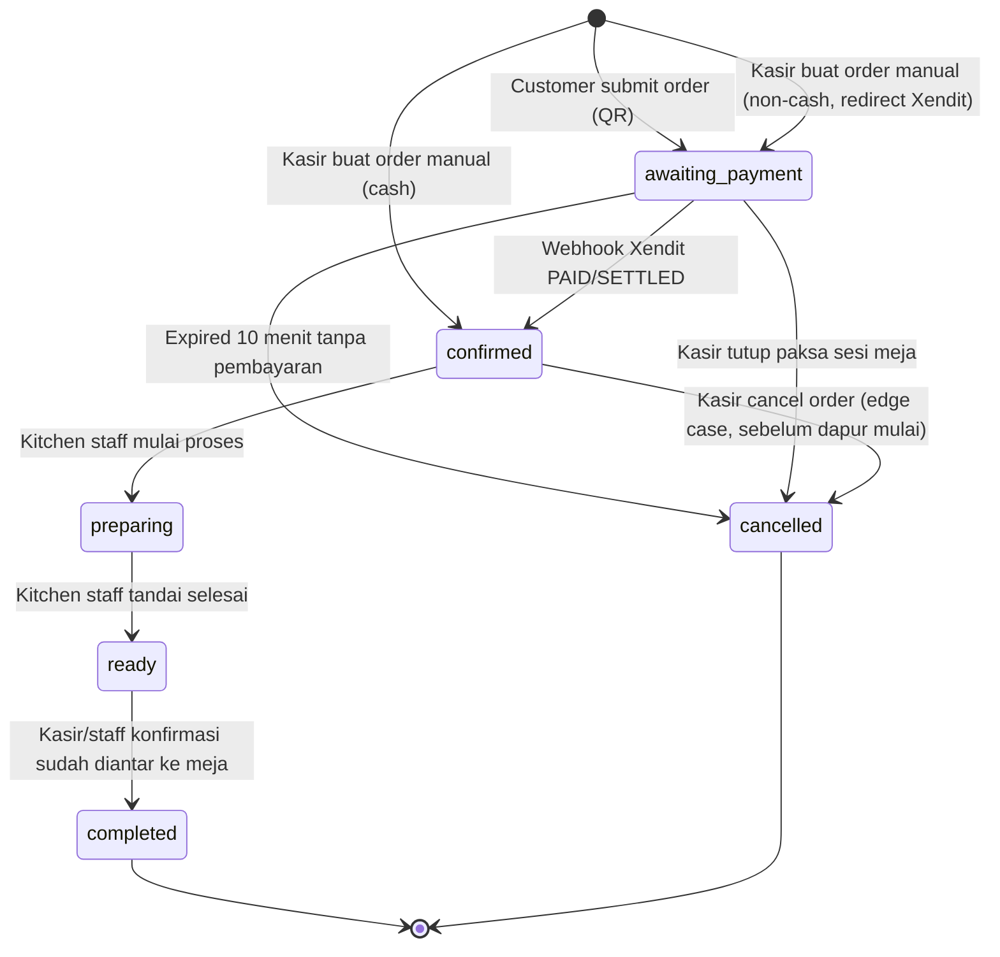
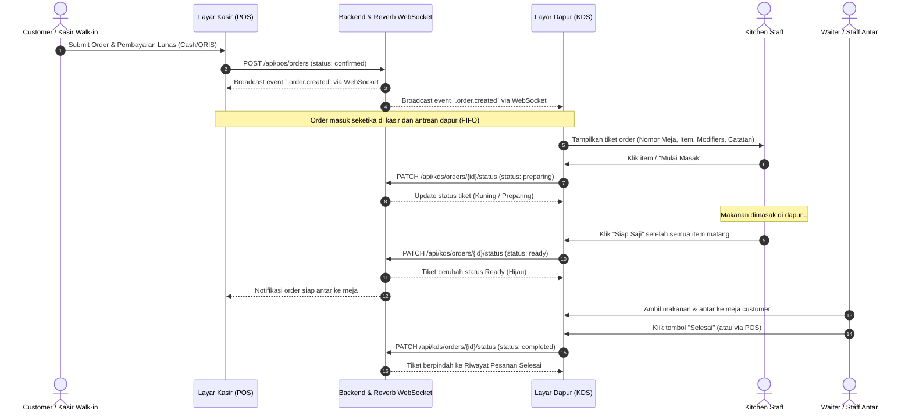

# Product Requirements Document (PRD)
## Sistem POS Multi-Tenant SaaS dengan Self-Order via QR Code

**Versi:** 1.4 (Draft)
**Tanggal:** 28 Agustus 2026
**Status:** Draft untuk Diskusi

> **Ringkasan perubahan dari v1.1 → v1.2:** Model payment gateway untuk transaksi customer order diubah dari **per-tenant credentials** (tiap tenant daftar & pakai akun payment gateway sendiri) menjadi **split settlement via akun master platform** menggunakan **Xendit xenPlatform** (tenant di-onboard sebagai sub-merchant/sub-account). Perubahan ini menyentuh: arsitektur (1.3), alur onboarding tenant (2.4a), feature matrix & menu sidebar owner (3.1, 3.2), alur pembayaran self-order (5.2, 5.4), model data (8), kebijakan refund (13, keputusan #12), dan detail teknis integrasi (13.1).
>
> **Ringkasan perubahan v1.2 → v1.3:** Payment gateway untuk **billing subscription platform** (tagihan ke tenant) yang sebelumnya memakai Midtrans, sekarang **diganti ke Xendit juga**. Jadi seluruh sistem — baik billing subscription platform maupun transaksi customer order — memakai **satu provider (Xendit)**, meski tetap 2 akun/integrasi Xendit yang terpisah secara fungsi (lihat 1.3 & catatan di bawah).
>
> **Ringkasan perubahan v1.3 → v1.4:** Klarifikasi dan penambahan detail berdasarkan review PRD: (1) klarifikasi unit penagihan per-outlet saat upgrade plan, (2) penegasan role Owner vs Admin Tenant untuk MVP, (3) penambahan Order Status Lifecycle diagram (state machine formal), (4) penambahan alur detail order manual kasir (non-QR), (5) penambahan detail alur refund, (6) penambahan edge case session timeout, (7) catatan scope menu (Outlet vs Tenant), (8) ketentuan teknis tambahan (timezone, rate limiting, file upload, subdomain validation, locale). Tidak ada perubahan keputusan bisnis/arsitektur — murni penajaman detail yang sudah implisit di v1.3.

---

## 1. Latar Belakang & Tujuan

### 1.1 Latar Belakang
Banyak resto/cafe skala kecil-menengah masih menggunakan sistem POS konvensional yang tidak terintegrasi dengan pemesanan mandiri pelanggan. Produk ini adalah platform POS berbasis SaaS yang bisa digunakan banyak bisnis (multi-tenant), dengan fitur unggulan **self-order via QR code di meja** dan **notifikasi realtime** ke kasir/dapur.

### 1.2 Tujuan Produk
- Menyediakan sistem POS yang bisa disewa (subscription) oleh banyak resto/cafe secara independen.
- Mengurangi beban kasir dengan self-ordering pelanggan via QR code.
- Mempercepat alur pesanan dari meja → dapur → kasir dengan notifikasi realtime.
- Memberikan visibilitas laporan penjualan & stok ke owner tenant.

### 1.3 Arsitektur Umum (Decoupled)
| Layer | Teknologi | Fungsi |
|---|---|---|
| Backend/API | Laravel | Business logic, **REST API untuk SEMUA frontend non-Filament** (POS, customer order, DAN owner dashboard), multi-tenancy, auth, integrasi payment gateway |
| Database | **PostgreSQL** | Penyimpanan data utama, shared database dengan `tenant_id` scoping per model |
| Superadmin Panel | Filament | Kelola semua tenant, plan, billing, suspend akun — dipakai developer/pemilik platform |
| Tenant Panel (Owner Dashboard) | **Vue 3 + Vite** — konsumsi REST API Laravel | Kelola menu, meja/QR, user, laporan — dipakai owner resto/cafe (client), tampilan dibranding sebagai produk SaaS sendiri |
| Web POS & Customer Order | Vue 3 + Vite | Kasir/POS interface & halaman self-order pelanggan — tetap terpisah karena butuh UX realtime (Reverb) yang tidak cocok dibangun di Filament |
| Realtime | Laravel Reverb | WebSocket notifikasi order & status, dikonsumsi Vue (POS & customer order) |
| Storage | **S3-compatible object storage** (misal AWS S3 / DigitalOcean Spaces / MinIO self-hosted) | Foto menu (upload owner), file QR code hasil generate (PDF/PNG) — **perlu diputuskan sebelum ERD**: pakai local disk (murah, MVP, tapi tidak scalable & rawan hilang saat redeploy) atau langsung object storage (sedikit lebih effort setup, tapi aman untuk production & mendukung horizontal scaling backend) |
| Payment Gateway (Platform Billing) | **Xendit (akun milik platform sendiri, terpisah dari akun master customer order)** | Menagih subscription fee ke tenant (signup, upgrade plan) — akun ini **terpisah total** dari akun Xendit yang dipakai untuk transaksi customer order (lihat baris di bawah & keputusan #6) |
| Payment Gateway (Customer Order) | **Xendit xenPlatform** (atau PJP setara berlisensi BI yang punya fitur platform/marketplace split settlement) — **1 akun master milik platform**, tenant di-onboard sebagai **sub-merchant/sub-account** | Terima pembayaran self-order dari customer (QRIS, e-wallet, dll), dana otomatis di-split & disettle ke rekening tenant lewat Split Rule API — **tenant tidak perlu daftar akun payment gateway sendiri** (keputusan #6, revisi) |
| Mobile (Fase 2) | React Native | Kasir mobile / owner app — **karena semua fitur (menu, user, laporan, order) sudah API-first sejak MVP**, React Native tinggal konsumsi API yang sama, tidak perlu bikin endpoint baru dari nol |

> **Penting — 2 integrasi Xendit yang terpisah dan tidak boleh tertukar (sama provider, beda akun & tujuan):**
> 1. **Xendit Platform Billing** (akun milik kamu) — dipakai untuk self-service signup/trial→subscription dan upgrade plan tenant. Secret key/API key disimpan di `.env` platform (bukan per-tenant), karena ini satu akun tetap milik bisnis kamu.
> 2. **Xendit xenPlatform — Akun Master Customer Order** (akun milik kamu juga, bukan milik tenant) — dipakai untuk transaksi customer order di semua outlet. Tenant **tidak menyimpan server key/client key sendiri** — cukup terdaftar sebagai sub-account di bawah akun master, diidentifikasi via `sub_account_id` yang disimpan di tabel `tenant_payment_accounts`.
>
> Meskipun kedua akun ini sama-sama Xendit, webhook handler untuk keduanya **tetap harus dipisah endpoint-nya** (misal `/webhook/xendit/platform-billing` vs `/webhook/xendit/customer-order`) karena beda akun, beda tujuan bisnis, dan berpotensi beda payload/event type — bukan soal beda tenant, karena masing-masing cuma ada 1 akun master untuk seluruh platform.

> **Rekomendasi:** Langsung pakai object storage (S3-compatible) sejak MVP, bukan local disk. Alasan: section 9 sudah menetapkan "Backend stateless agar bisa horizontal scale" — local disk per server bertentangan dengan requirement ini (foto yang diupload di satu instance tidak otomatis muncul di instance lain). Biaya tambahan minim (DigitalOcean Spaces ~$5/bulan sudah cukup untuk MVP).

> **Keputusan arsitektur (final):** Filament **hanya** dipakai untuk Superadmin platform (internal tool, kamu). Owner tenant menggunakan **dashboard Vue terpisah** yang mengonsumsi REST API Laravel yang sama dengan POS kasir dan customer order. Keputusan ini diambil demi **branding SaaS yang konsisten** — owner dashboard, POS, dan customer order semua terasa seperti satu produk yang koheren, bukan campuran admin-panel generic dan custom app. Ini juga menjaga arsitektur tetap **fully decoupled**: satu API dipakai oleh semua frontend (POS, dashboard owner, dan React Native di fase 2), tidak ada jalur akses langsung ke database di luar Filament superadmin.
>
> **Trade-off yang disadari:** Effort development untuk owner dashboard lebih besar dibanding memakai fitur Multi-Tenancy bawaan Filament (semua CRUD menu, meja/QR generator, user management, laporan+chart harus dibangun manual di Vue + endpoint API-nya). Timeline MVP kemungkinan lebih panjang, tapi hasil akhirnya lebih matang untuk dijual sebagai produk SaaS.
>
> **Trade-off yang disadari:** Backend API Laravel untuk saat ini hanya API-first di bagian POS/order/payment. Bagian manajemen data (menu, meja, user, laporan) diakses langsung oleh Filament (Livewire, bukan lewat REST API). Jika di fase 2 React Native butuh fitur kelola menu dari HP, endpoint API untuk itu perlu dibuat menyusul.

---

## 2. Model Bisnis: Multi-Tenant SaaS

### 2.1 Definisi Tenant
Satu **tenant** = satu bisnis (resto/cafe) yang berlangganan. Satu tenant bisa punya satu atau lebih **outlet/cabang** (rekomendasi: desain skema sudah siap multi-outlet dari awal walau MVP fokus 1 outlet per tenant, supaya tidak perlu migrasi besar nanti).

### 2.2 Strategi Isolasi Data (Perlu Diputuskan)
| Opsi | Kelebihan | Kekurangan |
|---|---|---|
| **Single DB, shared schema + `tenant_id`** (rekomendasi awal) | Simpel, murah, mudah maintain & migrate | Perlu disiplin ketat di query (global scope) agar tidak bocor data antar tenant |
| Single DB, multi-schema | Isolasi lebih baik | Kompleksitas migrasi lebih tinggi |
| Database per tenant | Isolasi maksimal, mudah backup/restore per tenant | Biaya infra & maintenance lebih tinggi saat tenant banyak |

**Rekomendasi:** Mulai dengan **shared database + `tenant_id`** menggunakan package seperti `stancl/tenancy` atau global scope custom Laravel + middleware resolusi tenant. Ini paling cepat untuk MVP dan cukup aman kalau diimplementasi dengan benar (global scope wajib di semua model, tidak boleh ada query tanpa scope tenant).

### 2.3 Resolusi Tenant
Opsi: subdomain (`tenantA.namaapp.com`), custom domain, atau path-based (`namaapp.com/tenantA`). 
**Rekomendasi:** Subdomain untuk MVP (lebih mudah + tetap terlihat profesional), custom domain sebagai fitur plan premium di fase berikutnya.

### 2.4 Subscription & Billing

Billing platform menggunakan model **self-service penuh**: tenant mendaftar sendiri, mendapat trial 14 hari, lalu memilih & membayar plan sendiri via Xendit Platform Billing tanpa campur tangan tim. Model pricing **per outlet per bulan** — tenant membayar berdasarkan jumlah outlet aktif. Recurring billing memakai model "generate invoice + link bayar tiap siklus" (bukan auto-debit kartu tersimpan). Detail alur onboarding, lifecycle status, dan enforcement batas plan dijabarkan di sub-section berikut.

### 2.4a Alur Onboarding Tenant

**Keputusan Final: Opsi A — Self-Service Signup.** Calon tenant isi form sendiri di landing page (`namaapp.com/daftar`), langsung dapat subdomain & trial 14 hari, tanpa campur tangan tim untuk tiap tenant baru. Ini konsisten dengan keputusan self-service billing (lihat di bawah) — signup dan subscription checkout memakai filosofi yang sama: orang asing bisa langsung transaksi tanpa sentuhan tim.

**Alur onboarding self-service (MVP), langkah demi langkah:**
1. Calon tenant buka landing page, klik "Daftar Sekarang" → isi form: nama bisnis, email, password, pilih subdomain (validasi real-time ketersediaan & format subdomain).
2. Sistem validasi anti-spam signup (rate limiting per IP, captcha) untuk mencegah spam registrasi publik.
3. Sistem otomatis membuat: 1 `Tenant` baru (status `trial`, `trial_ends_at` = sekarang + 14 hari), 1 `Outlet` default, 1 `User` dengan role Owner.
4. Email verifikasi dikirim ke owner, tapi **tidak memblokir penggunaan awal** — owner tetap bisa langsung login & mulai setup sambil verifikasi berjalan di background (supaya onboarding tidak terhambat friksi verifikasi).
5. Owner langsung diarahkan ke Vue Owner Dashboard (`tenantX.namaapp.com`) untuk mulai setup: menu, meja/QR, dan **data rekening bank untuk pencairan dana** (bukan input server key/client key lagi — lihat 13.1, model sub-merchant di bawah akun master platform).
6. Dashboard menampilkan banner countdown sisa hari trial.
7. **H-3 sebelum trial habis**, sistem kirim reminder ke owner lewat **WA dan Email** (lihat 2.4b).
8. Saat trial habis, sistem tampilkan halaman **"Pilih Paket Langganan"** (wajib pilih tier Basic/Pro) yang mengarahkan ke checkout pembayaran via **Xendit Platform Billing** — akun platform, bukan akun/sub-account tenant. Setelah bayar sukses, status tenant otomatis jadi `active`.
9. Jika belum bayar sampai lewat trial → masuk grace period `overdue` 3 hari (lihat 2.4b) → jika masih belum bayar → `suspended`.

**Perlu endpoint/halaman tambahan:** `POST /api/tenant/register` (signup publik, rate-limited), `POST /api/tenant/check-subdomain` (validasi ketersediaan real-time), `GET/POST /api/subscription/checkout` (dipakai bersama untuk alur pilih-tier-pasca-trial DAN upgrade plan — lihat di bawah), webhook `POST /webhook/xendit/platform-billing`.

### 2.4b Lifecycle Status Tenant & Perilaku Sistem Saat Menunggak/Suspend


**Status tenant (state machine sederhana):**
`trial` → `active` (lunas) → `overdue` (menunggak, grace period) → `suspended` (akses diblokir) → `active` (setelah bayar) / `churned` (tenant berhenti)

| Status | Akses Owner Dashboard | Akses Kasir/KDS | Akses Customer (QR) |
|---|---|---|---|
| `trial` | Penuh | Penuh | Penuh |
| `active` | Penuh | Penuh | Penuh |
| `overdue` (grace period **3 hari, final** setelah jatuh tempo) | Penuh, tapi ada banner peringatan tagihan di semua halaman | Tetap jalan normal (operasional resto tidak boleh terganggu mendadak) | Tetap jalan normal |
| `suspended` | Bisa login, tapi hanya lihat halaman billing/status (fitur lain terkunci) | Halaman menampilkan pesan blocking: *"Langganan tenant ini sedang tidak aktif. Hubungi admin resto."* — order baru tidak bisa diproses | Halaman menu menampilkan pesan: *"Maaf, outlet ini sedang tidak tersedia."* — tidak bisa checkout |
| `churned` | Tidak bisa login — akun dinonaktifkan. Data disimpan 30 hari untuk kemungkinan reaktivasi (soft-delete), lalu dihapus permanen oleh job terjadwal. Owner bisa minta export data via Superadmin selama masa 30 hari ini. | Tidak bisa akses | Tidak bisa akses |

**Notifikasi tagihan ke Owner (bukan ke customer, jadi tidak melanggar keputusan #11):**
Dikirim lewat **2 kanal sekaligus: WhatsApp dan Email** untuk: (a) reminder H-3 sebelum trial/masa aktif habis, (b) notifikasi saat masuk status `overdue`, (c) notifikasi saat `suspended`. Email tetap transaksional sederhana dari Laravel. WA butuh integrasi provider pihak ketiga (misal Fonnte/Wablas/WhatsApp Cloud API) — ini API tambahan baru di stack, dipakai **khusus untuk notifikasi tagihan ke owner tenant**, bukan untuk notifikasi ke customer (tetap sesuai keputusan #11 yang melarang WA ke customer).

### 2.4c Kebijakan Billing & Pricing

- **Data saat tenant churn:** Data tenant **tidak langsung dihapus** saat status jadi `churned` — disimpan (soft-delete / flag `churned_at`) minimal 30 hari untuk kemungkinan reaktivasi, baru dihapus permanen setelahnya oleh job terjadwal. Tenant bisa minta export data (menu, laporan penjualan) dalam masa 30 hari ini via request manual ke Superadmin (tidak perlu fitur self-service export di MVP).
- **Model pricing: per outlet** — tenant membayar berdasarkan jumlah outlet aktif (misal: Rp X/outlet/bulan). Skema ini mendorong desain data sejak awal agar `Outlet` jadi unit billing utama, bukan `Tenant`.
- **Billing self-service via Xendit Platform Billing (bukan manual lagi).** Setelah trial 14 hari habis, owner memilih tier & bayar sendiri lewat checkout Xendit (akun platform) — sistem otomatis update status jadi `active` setelah pembayaran sukses, tanpa campur tangan Superadmin. Ini konsekuensi langsung dari keputusan self-service signup (2.4a) — kalau signup tanpa sentuhan tim, billing pun harus bisa jalan tanpa sentuhan tim.
- **Recurring billing** (tagihan bulanan otomatis untuk siklus berikutnya) tetap perlu di-generate ulang oleh sistem (misal via scheduled job Laravel) yang membuat transaksi Xendit Invoice baru H-3 sebelum jatuh tempo periode berikutnya, dikirim sebagai link pembayaran ke owner (bukan pendebetan otomatis dari kartu tersimpan — model yang dipakai adalah **"generate invoice + link bayar tiap siklus"** via Xendit Invoice API, bukan auto-debit/tokenisasi kartu).
- Superadmin tetap bisa suspend/aktifkan tenant/outlet tertentu secara manual (override) jika ada kasus khusus, di luar alur otomatis di atas.
- Batasan per outlet (jumlah meja/QR, jumlah user) bisa diatur di plan.

**Perilaku sistem saat batas plan tercapai (self-service upgrade)**: validasi dilakukan di backend saat request create (meja baru / invite user baru), bukan hanya di UI. Kalau limit tercapai:
- Tombol "Tambah Meja"/"Invite User" di Vue Owner Dashboard tetap terlihat, tapi memicu modal **"Upgrade ke Pro"** berisi ringkasan tier baru & harga, dengan tombol "Bayar & Upgrade Sekarang".
- Klik tombol → generate transaksi Xendit (akun **Platform Billing**, sama seperti alur pilih-tier-pasca-trial di 2.4a — **1 mekanisme checkout dipakai ulang** untuk kedua skenario ini).
- Setelah pembayaran sukses (webhook `/webhook/xendit/platform-billing`) → `plan_id` tenant otomatis ter-update, limit baru langsung berlaku, aksi yang tadi terblokir (tambah meja/user) bisa langsung diulang oleh owner.
- Endpoint API tetap mengembalikan HTTP 422 dengan pesan yang sama jika ada request yang lolos validasi frontend (misal race condition 2 tab browser).
- **Catatan skema harga saat upgrade di tengah siklus:** untuk MVP, upgrade langsung ditagih **harga penuh tier baru** (tanpa prorata sisa periode) demi kesederhanaan implementasi; perhitungan prorata bisa masuk penyempurnaan di fase berikutnya jika dibutuhkan.

**Klarifikasi unit penagihan per-outlet:**
- Saat upgrade Basic → Pro, tenant ditagih **harga tier Pro × jumlah outlet aktif saat ini** (bukan per slot kapasitas maksimum plan).   tenant punya 1 outlet aktif di Basic, upgrade ke Pro → ditagih 1 × harga Pro, bukan 3 × harga Pro walau Pro mendukung hingga 3 outlet.
- Jika tenant **menambah outlet baru** setelah upgrade (dalam siklus billing yang sama), outlet baru **langsung ditagih harga penuh tier saat ini** (tanpa prorata, konsisten dengan kebijakan di atas). Tagihan outlet tambahan masuk di invoice recurring siklus berikutnya.
- Invoice recurring bulanan yang di-generate H-3 sebelum jatuh tempo secara otomatis menghitung **jumlah outlet aktif pada saat invoice di-generate** sebagai basis penagihan.
- Jika owner menonaktifkan/menghapus outlet di tengah siklus, tagihan siklus berjalan **tidak dikurangi** (sudah dibayar); pengurangan baru berlaku di siklus berikutnya.

---

## 3. Target Pengguna (Roles)

| Role | Level | Deskripsi |
|---|---|---|
| **Superadmin** | Platform | Kelola tenant, plan, billing, monitoring seluruh platform — via **Filament** |
| **Owner/Admin Tenant** | Tenant | Kelola outlet, menu, user, lihat laporan — via **Vue Owner Dashboard** |
| **Kasir** | Outlet | Proses pembayaran, kelola order masuk — via **Vue POS** |
| **Kitchen Staff** | Outlet | Lihat & update status order di KDS — via **Vue POS** (route/URL terpisah dalam aplikasi Vue yang sama: `/kds`, diakses dari browser terpisah di layar dapur) |
| **Customer** | End-user (tanpa akun) | Scan QR, pesan, bayar, tracking status — via **Vue Customer Order** |

> **Klarifikasi role Owner vs Admin Tenant (MVP):**
> Untuk MVP, setiap tenant hanya memiliki **1 akun Owner** (dibuat saat signup, tidak bisa didelegasikan). Owner **tidak bisa menginvite "Admin" lain** dengan akses setara — hanya bisa menginvite **Kasir** dan **Kitchen Staff**. Jika Owner berhalangan (sakit/cuti), operasional outlet tetap berjalan karena Kasir dan Kitchen Staff bisa mengakses POS/KDS secara mandiri — tetapi pengaturan tingkat tenant (menu management, pengaturan pembayaran, billing & upgrade plan, user management) hanya bisa diakses Owner. Fitur **delegasi admin** (invite co-owner/admin dengan akses penuh atau sebagian) ditunda ke fase berikutnya jika ada kebutuhan nyata dari tenant. Label "Owner/Admin" di tabel di atas merujuk ke **satu role yang sama**, bukan dua role terpisah.

### 3.1 Daftar Fitur per Role (Feature Matrix)

#### A. Superadmin (via Filament)
- Kelola daftar tenant: create, view, edit, suspend/aktifkan tenant
- Kelola plan langganan: buat/edit plan (Basic, Pro), atur batasan (maks meja/QR, maks user staff)
- Assign/ubah plan yang dipakai tiap tenant
- Billing: monitoring status pembayaran subscription tenant (otomatis via webhook Xendit Platform Billing), lihat riwayat invoice, override status manual untuk kasus darurat (misal webhook gagal)
- Monitoring global: daftar semua tenant aktif, jumlah outlet per tenant, status verifikasi sub-account Xendit tiap tenant (read-only)
- Dashboard ringkasan platform: total tenant aktif, total tenant baru per bulan, churn
- Kelola user internal platform (tim kamu sendiri) dengan role/permission
- Audit log aktivitas penting (suspend tenant, ubah plan, dll)

#### B. Owner/Admin Tenant (via Vue Owner Dashboard)
- Kelola outlet (tambah outlet baru jika plan mengizinkan lebih dari 1)
- Manajemen menu: CRUD kategori & item menu, upload foto, atur harga, atur varian/opsi tambahan
- Manajemen stok: tandai item habis/tersedia, atau stok berbasis angka (auto-kurang per order)
- Manajemen meja & QR code: tambah meja, generate QR unik per meja, download QR (PDF/PNG untuk cetak), regenerate/invalidate QR token, atur durasi timeout table session per outlet
- Kelola sesi meja: lihat sesi meja yang sedang aktif, tutup sesi manual (override) jika perlu
- Pengaturan pembayaran: input/update data rekening bank tujuan pencairan dana, lihat status verifikasi sub-account ("Menunggu verifikasi" / "Siap menerima pembayaran"), lihat riwayat settlement/pencairan dana
- Manajemen user: invite/kelola akun kasir & kitchen staff, atur role/permission per user
- Laporan & analytics: laporan penjualan harian/mingguan/bulanan, menu terlaris, jam ramai (peak hours), ringkasan pendapatan per metode pembayaran, export CSV/PDF
- Kelola plan & langganan: lihat tier saat ini & batasan, **upgrade plan sendiri via Xendit Platform Billing**, lihat riwayat pembayaran subscription
- Pengaturan branding dasar outlet (nama tampilan, logo — untuk halaman customer order)

#### C. Kasir (via Vue POS)
- Lihat daftar order masuk realtime (dari QR maupun order manual), dikelompokkan per meja/table session
- Buat order manual untuk pelanggan walk-in tanpa QR
- Proses pembayaran untuk order manual (cash/kartu di tempat)
- Lihat & cetak struk digital di layar (tanpa printer thermal untuk MVP)
- Tandai menu habis secara cepat (quick toggle, tanpa masuk ke menu management penuh)
- Lihat & tutup sesi meja manual (override) jika kasir melihat meja sudah kosong
- Lihat ringkasan penjualan shift berjalan (opsional, sederhana)

#### D. Kitchen Staff (via Vue KDS - Kitchen Display System)
- Lihat antrian order masuk realtime, dikelompokkan per meja & waktu masuk
- Lihat detail order (item, jumlah, catatan/permintaan khusus jika ada)
- Update status per item/order: `Preparing` → `Ready`
- Highlight visual untuk order yang sudah lama menunggu (SLA warning)

#### E. Customer (via Vue Customer Order, tanpa akun/login)
- Scan QR code di meja untuk akses menu
- Browse menu per kategori, lihat foto, harga, status stok (habis/tersedia)
- Tambah item ke keranjang, atur jumlah
- Submit order → diarahkan ke pembayaran via Xendit (Pay First)
- Lacak status order secara realtime: `Pending → Confirmed → Preparing → Ready → Served/Completed`
- Tambah pesanan baru selama table session masih aktif (belum timeout)
- Lihat riwayat order dalam sesi kunjungan saat ini saja (tidak tercampur sesi/kunjungan sebelumnya)

### 3.2 Breakdown Menu Sidebar per Role

#### A. Superadmin (Filament)
- Dashboard — ringkasan platform (total tenant, growth, dsb)
- Tenants — daftar semua tenant, detail, suspend/aktifkan
- Plans & Subscriptions — kelola paket (Basic/Pro), assign ke tenant
- Billing — monitoring pembayaran subscription (otomatis), override manual jika perlu
- Platform Users — tim internal platform, role & permission
- Audit Log — riwayat aktivitas penting
- Settings — pengaturan platform-wide

#### B. Owner Tenant (Vue Dashboard)
- Dashboard — ringkasan penjualan hari ini, grafik singkat
- Menu
  - Kategori
  - Item Menu
  - Stok (quick toggle habis/tersedia, atau kelola angka stok per item)
- Meja & QR Code — daftar meja, generate/download QR
- Sesi Meja — lihat sesi aktif, tutup manual jika perlu
- Laporan
  - Penjualan (harian/mingguan/bulanan)
  - Menu Terlaris
  - Jam Ramai
- Staff — kelola user kasir & kitchen, role
- Pengaturan
  - Payment (data rekening bank + status verifikasi sub-account Xendit)
  - Branding Outlet (nama, logo)
  - Plan & Langganan (lihat tier, **upgrade sendiri**, riwayat pembayaran)

#### C. Kasir (Vue POS)
- Order Masuk — layar utama, live order dari QR & manual
- Order Manual — buat order walk-in
- Riwayat Transaksi
- Meja — status meja & sesi (tutup manual jika perlu)
- Menu — quick toggle stok habis/tersedia
- *(Profil/Logout di header, bukan sidebar utama)*

#### D. Kitchen Staff (Vue KDS)
- Antrian Order — layar utama, order masuk realtime per status
- Riwayat Selesai — order yang sudah completed hari ini
- *(Sidebar minimal, karena KDS lazimnya full-screen board untuk operasional dapur, bukan navigasi kompleks)*

#### E. Customer (Vue Self-Order)
Tidak memakai sidebar — flow linear tanpa login via scan QR, cukup bottom navigation sederhana:
- Menu (halaman utama setelah scan)
- Keranjang
- Status Pesanan (tracking realtime)

---

## 4. Ruang Lingkup (Scope)

### 4.1 In-Scope MVP
1. Self-order via QR Code + tracking status order
2. Kasir & pembayaran (cash, QRIS, kartu — via payment gateway)
3. Kitchen Display System (KDS)
4. Manajemen menu, kategori & stok
5. Laporan penjualan & analytics dasar
6. Multi-tenant onboarding **self-service** (signup mandiri, trial 14 hari) + isolasi data
7. Notifikasi realtime (Laravel Reverb)
8. **Self-service subscription billing via Xendit Platform Billing** (pilih tier pasca-trial, upgrade plan saat limit tercapai, notifikasi tagihan WA+Email ke owner)

### 4.2 Out-of-Scope MVP (Fase Berikutnya)
- Aplikasi mobile React Native (kasir/owner)
- Custom domain per tenant
- Integrasi loyalty/membership pelanggan
- Multi-outlet penuh (laporan konsolidasi antar cabang)
- Integrasi accounting eksternal
- Multi-bahasa & multi-currency
- Prorata harga saat upgrade di tengah siklus billing
- Auto-debit kartu tersimpan untuk recurring charge (MVP tetap pakai model invoice + link bayar tiap siklus)
- Offline-first untuk Kasir (order manual/cash tetap jalan saat internet putus)

---

## 5. Fitur Unggulan: Self-Order via QR Code

### 5.1 Alur Pengguna (Customer Flow)

> **Konteks model bisnis:** Ini model **cafe walk-in bebas** — customer bisa langsung duduk di meja mana saja tanpa perlu check-in/menunggu meja kosong dikonfirmasi kasir dulu. Karena itu, sistem butuh konsep **Table Session** untuk mengelompokkan order-order dalam satu kunjungan customer di meja tertentu, dan mencegah tracking status "nyasar" ke grup customer berikutnya yang duduk di meja yang sama.

**Konsep Table Session:**
- Saat customer scan QR dan submit order pertama di sebuah meja yang sedang tidak punya sesi aktif → sistem otomatis membuat `TableSession` baru untuk meja tersebut.
- Semua order berikutnya dari meja yang sama (misal customer nambah pesanan) masuk ke `TableSession` yang sama, selama sesi masih aktif.
- **Sesi otomatis ditutup setelah 60 menit tanpa aktivitas/order baru** (nilai default, dapat dikonfigurasi per outlet di **Vue Owner Dashboard**). Setelah sesi ditutup, meja dianggap "kosong" kembali — customer berikutnya yang scan QR akan memulai `TableSession` baru.
- Halaman tracking status customer (`/order/{outlet}/{table}`) hanya menampilkan order-order dari `TableSession` yang sedang aktif di meja tersebut, sehingga tidak tercampur dengan riwayat sesi sebelumnya.
- Kasir & KDS bisa melihat order dikelompokkan per `TableSession` untuk mempermudah tracking satu "kunjungan" customer, walau tiap order dibayar terpisah via Xendit (model Pay First).

**Alur langkah demi langkah:**
1. Pelanggan duduk bebas di meja mana saja, scan QR code unik per meja.
2. QR mengarah ke URL: `https://tenantA.namaapp.com/order/{outlet_id}/{table_code}` (token meja disertakan agar tidak bisa ditebak/di-manipulasi).
3. Sistem cek apakah meja punya `TableSession` aktif — jika tidak ada (atau sudah timeout), buat sesi baru.
4. Pelanggan melihat menu (kategori, harga, foto, status stok habis/tersedia).
5. Pelanggan menambahkan item ke keranjang, submit order → order tercatat di `TableSession` yang aktif.
6. Order masuk ke sistem dengan status `awaiting_payment`, diarahkan ke pembayaran via Xendit (lihat 5.2).
7. Setelah pembayaran sukses, notifikasi realtime terkirim ke Kasir & Kitchen Display.
8. Pelanggan melihat halaman tracking status order realtime (hanya order dalam sesi aktifnya): `Pending → Confirmed → Preparing → Ready → Served/Completed`.
9. Pelanggan bisa pesan tambahan (add more items) selama sesi meja masih aktif (belum timeout 60 menit).

### 5.2 Model Pembayaran: Pay First (Keputusan Final MVP)
Model yang dipakai adalah **Pay First (Prepaid)**: pelanggan wajib menyelesaikan pembayaran via Xendit sebelum order diteruskan ke dapur.

**Alur teknis:**
1. Pelanggan submit order → sistem membuat record `Order` dengan status `awaiting_payment` dan generate transaksi via Xendit API, dengan **Split Rule** yang mengarahkan dana ke `sub_account_id` tenant yang bersangkutan (mode **sandbox/test mode** untuk development).
2. Pelanggan diarahkan ke halaman/modal pembayaran Xendit (QRIS, e-wallet, kartu, dll sesuai channel yang diaktifkan di akun master platform).
3. Xendit mengirim **webhook notification** ke endpoint Laravel saat status pembayaran berubah.
4. Jika pembayaran sukses (`PAID`/`SETTLED`) → status order berubah jadi `confirmed` → broadcast event `OrderCreated` ke channel outlet (kasir & KDS baru menerima order di titik ini) → dana otomatis di-split & disettle ke rekening tenant sesuai Split Rule.
5. Jika payment `EXPIRED`/`FAILED` → order otomatis batal, meja bisa order ulang.

**Implikasi teknis penting:**
- Endpoint webhook harus idempotent (payment gateway bisa mengirim notifikasi lebih dari sekali).
- Perlu tabel/log transaksi (`transaction_id`, `order_id`, `tenant_id`, `status`, `raw_payload`) untuk audit & debugging.
- **Keputusan final (revisi):** dipakai **1 akun master Xendit xenPlatform milik platform** untuk semua tenant, dengan **split settlement otomatis** ke rekening masing-masing tenant (lihat 13.1). Tenant tidak perlu daftar/kelola akun payment gateway sendiri — cukup terverifikasi sebagai sub-account. `.env` hanya menyimpan credential akun master platform (`XENDIT_SECRET_KEY`, dst), tidak ada lagi credential per-tenant yang disimpan terenkripsi di database.

### 5.2.1 Order Status Lifecycle (State Machine)

Berikut state machine formal untuk status `Order`, termasuk siapa yang men-trigger setiap transisi dan kondisi guard-nya:



**Detail transisi:**

| Dari | Ke | Trigger oleh | Kondisi |
|---|---|---|---|
| *(baru)* | `awaiting_payment` | Sistem | Customer submit order via QR, atau kasir buat order non-cash |
| *(baru)* | `confirmed` | Kasir | Order manual dengan pembayaran cash (langsung confirmed, tidak lewat `awaiting_payment`) |
| `awaiting_payment` | `confirmed` | Sistem (webhook) | Xendit kirim notifikasi `PAID`/`SETTLED` |
| `awaiting_payment` | `cancelled` | Sistem (scheduler) | 10 menit tanpa pembayaran (auto-expire) |
| `awaiting_payment` | `cancelled` | Kasir | Tutup paksa sesi meja (order otomatis di-cancel) |
| `confirmed` | `preparing` | Kitchen Staff | Mulai proses item di KDS |
| `confirmed` | `cancelled` | Kasir | Cancel order sebelum dapur mulai proses (misal: customer minta batal setelah bayar → perlu refund terpisah, lihat 6.6) |
| `preparing` | `ready` | Kitchen Staff | Semua item di order selesai dimasak |
| `ready` | `completed` | Kasir / Staff | Konfirmasi pesanan sudah diantar/diambil customer |

> **Catatan:** Status `served` (terpisah dari `completed`) **tidak dipakai di MVP** demi kesederhanaan — transisi langsung dari `ready` ke `completed` saat pesanan diantar. Jika di fase berikutnya perlu tracking granular (ready → served → completed), status `served` bisa ditambahkan tanpa mengubah alur yang sudah ada.

### 5.2.2 Alur Operasional: Order Masuk → Masak di Dapur → Siap Saji (End-to-End Flow)

Berikut visualisasi dan tahapan operasional dari pesanan masuk hingga makanan selesai disajikan:



#### Tahapan Rinci Alur Pesanan:

1. **Order Masuk (`confirmed`)**:
   - **Sumber**: Pelanggan scan QR meja (bayar lunas via QRIS) atau kasir input via `ManualOrderPage` (bayar cash/EDC).
   - **Status**: Disimpan dengan status `confirmed`, meja berstatus `occupied` (`filled`).
   - **Realtime**: Laravel Reverb memancarkan event `.order.created` ke channel `outlet.{outletId}`, seketika memunculkan kartu pesanan di **Halaman Order Masuk POS** dan **Antrean Pesanan KDS**.

2. **Antrean Dapur & Mulai Masak (`preparing`)**:
   - **Tampilan**: Di KDS (`OrderQueuePage`), kartu pesanan tersusun berurutan secara **FIFO** (pesanan paling awal masuk di sebelah kiri) dengan timer durasi tunggu (`X mnt`) dan waktu pemesanan sinkron.
   - **Item Checklist**: Kitchen staff meninjau rincian item, varian, dan catatan khusus (misal: *"kurangi gula"*, *"pedas"*).
   - **Proses**: Kitchen staff mencentang item atau klik mulai proses → status pesanan berganti ke `preparing`. Status ini tersinkronisasi realtime ke tracking order pelanggan.

3. **Pesanan Siap Saji (`ready`)**:
   - **Pemicu**: Setelah seluruh hidangan matang dan siap di meja pick-up dapur, Kitchen Staff menekan tombol **"Siap Saji"**.
   - **Status**: Berubah menjadi `ready` (badge hijau menyala).
   - **Notifikasi**: Kasir dan waiter mengetahui bahwa pesanan untuk nomor meja tersebut siap diantar.

4. **Pengantaran & Selesai (`completed`)**:
   - **Pengantaran**: Waiter mengambil hidangan dan menyajikannya ke meja pelanggan (atau diserahkan ke pelanggan takeaway).
   - **Selesai**: Staff menekan tombol **"Selesai"** pada kartu pesanan.
   - **Pengarsipan**: Pesanan dinyatakan `completed` dan berpindah ke halaman riwayat **Pesanan Selesai** (`CompletedOrdersPage`).
   - **Sesi Meja**: Sesi meja tetap aktif (`filled`) hingga pelanggan beranjak dan kasir menutup sesi meja secara manual atau via timeout sistem.

### 5.3 Manajemen QR Code
- Setiap meja punya kode unik (generate QR by outlet + table di **Vue Owner Dashboard** — bukan Filament, sesuai keputusan #5).
- QR bisa di-regenerate (invalidate token lama) jika dicurigai disalahgunakan.
- QR bisa didownload sebagai PDF/PNG untuk dicetak & ditempel di meja.

### 5.4 Concurrency & Edge Cases


| Skenario | Perilaku yang diusulkan |
|---|---|
| **Grup nongkrong, tiap orang scan QR dari HP masing-masing di meja yang sama** | Semua HP yang scan QR meja X yang sama akan join ke `TableSession` aktif yang sama — mereka **saling melihat** semua order yang masuk ke sesi tersebut di halaman tracking (transparan, karena satu meja dianggap satu grup). Ini perlu didokumentasikan sebagai perilaku yang disengaja, bukan bug, supaya tim support tidak bingung saat ada pertanyaan customer. |
| **Stok item habis di tengah proses order** (2 customer checkout item terakhir hampir bersamaan) | Validasi stok dilakukan **dua kali**: saat item ditambah ke keranjang (soft-check, hanya UX) dan **saat submit order ke backend** (hard-check dengan DB transaction/row lock). Jika kalah race condition, order kedua ditolak dengan pesan jelas: *"Maaf, [item] baru saja habis. Silakan pilih menu lain."* — bukan silent fail. |
| **Kasir menutup sesi meja manual saat masih ada order berstatus `awaiting_payment`** | Sistem **mencegah** penutupan manual jika masih ada order `awaiting_payment` yang belum expired (10 menit, sesuai keputusan #8) — tampilkan konfirmasi: *"Masih ada 1 order menunggu pembayaran, tutup paksa?"*. Kalau kasir tetap paksa tutup, order tersebut otomatis di-cancel. |
| **Customer submit order, lalu koneksi putus sebelum redirect ke Xendit selesai** | Order tetap tercatat `awaiting_payment` di backend (bukan hilang). Saat customer scan ulang QR yang sama sebelum window 10 menit habis, sistem mendeteksi ada order `awaiting_payment` di sesi aktifnya dan menawarkan **lanjutkan pembayaran** (bukan buat order baru), untuk menghindari double order untuk item yang sama. |
| **Webhook Xendit datang lebih dari sekali (duplicate notification)** | Sudah disebut di 5.2 ("idempotent"), dipertegas di sini: gunakan `transaction_id` Xendit sebagai unique key, webhook kedua dengan status sama cukup di-log tanpa broadcast ulang `OrderCreated` ke Kasir/KDS (mencegah notifikasi dobel yang mengganggu operasional dapur). |
| **Customer masih duduk di meja tapi session timeout (idle >60 menit, misal ngobrol lama tanpa pesan)** | Sesi otomatis ditutup sesuai timeout yang dikonfigurasi. Saat customer scan ulang QR → **sesi baru terbentuk**, order lama tidak terlihat di tracking page sesi baru. Ini adalah perilaku yang disengaja dan didokumentasikan: timeout = sesi baru. **Tidak ada mekanisme "extend session"** di MVP — customer cukup scan ulang untuk mulai sesi baru. Workaround: owner bisa set timeout lebih panjang (misal 120 menit) di pengaturan outlet jika target customer-nya sering nongkrong lama. Riwayat order dari sesi lama tetap tersimpan di database dan tetap terlihat di laporan penjualan owner. |

---

### 5.5 Order Manual Kasir (Non-QR) — Alur Detail

Selain order via QR (Pay First, section 5.1-5.2), kasir juga bisa membuat order manual untuk pelanggan walk-in yang tidak scan QR. Alur ini berbeda dari alur QR karena pembayaran bisa dilakukan secara **cash di tempat** (tidak lewat Xendit).

**Alur langkah demi langkah:**
1. Kasir membuka Vue POS, pilih meja tujuan (atau pilih "Tanpa Meja" untuk takeaway/bungkus).
2. Jika meja dipilih dan belum punya `TableSession` aktif → sistem otomatis membuat sesi baru (sama seperti alur QR). Jika sudah ada sesi aktif → order baru masuk ke sesi yang sama.
3. Kasir input item pesanan dari daftar menu (sama seperti yang dilihat customer di QR, termasuk varian & add-on).
4. Kasir pilih metode pembayaran:
   - **Cash:** Order langsung dibuat dengan status `confirmed` (skip `awaiting_payment`). Kasir input nominal yang diterima, sistem hitung kembalian, tampilkan di layar. Tidak ada transaksi ke Xendit — pembayaran dicatat internal saja.
   - **Non-cash (QRIS/e-wallet/kartu via Xendit):** Order dibuat dengan status `awaiting_payment`, sama seperti alur QR — kasir diarahkan ke halaman pembayaran Xendit (atau menampilkan QRIS di layar POS untuk discan customer). Setelah webhook sukses → status jadi `confirmed`.
5. Setelah `confirmed` → broadcast event `OrderCreated` ke KDS (sama seperti order QR).
6. Struk digital ditampilkan di layar POS.

**Implikasi data model:**
- Field `Order.source` membedakan asal order: `qr` (dari customer via QR) vs `manual_kasir` (dari kasir).
- Field `Order.payment_method` menyimpan metode pembayaran: `xendit_qris`, `xendit_ewallet`, `cash`, dll.
- Untuk order cash, record `Payment` tetap dibuat untuk kelengkapan laporan, dengan `payment_method = cash` dan `transaction_id = null` (tidak ada transaksi Xendit). Ini memastikan laporan penjualan per metode pembayaran (section 6.4) bisa menghitung semua order tanpa exception.
- Validasi stok tetap berlaku untuk order manual (hard-check di backend saat submit, sama seperti order QR).

**Endpoint API tambahan:**
- `POST /api/orders/manual` — kasir submit order manual (payload: outlet_id, table_id/null, items[], payment_method). Membutuhkan autentikasi Sanctum + role kasir/owner.

---

## 6. Fitur Detail Lainnya

### 6.1 Kasir (POS Web - Vue)
- Lihat daftar order masuk realtime (dari QR maupun input manual kasir) — order dari QR sudah pasti berstatus `confirmed` (sudah bayar via Xendit) karena model Pay First.
- Buat order manual untuk pelanggan walk-in/tanpa QR (kasir input langsung, proses pembayaran cash/kartu di tempat).
- **Struk: tampilan digital dulu untuk MVP** — struk ditampilkan di layar (bisa di-screenshot/dikirim ke WhatsApp pelanggan jika perlu), tanpa integrasi printer thermal. Integrasi printer fisik masuk fase berikutnya jika dibutuhkan.
- Split bill (fase 2 jika kompleks).

### 6.2 Kitchen Display System (KDS)
- Layar khusus dapur menampilkan antrian order realtime, dikelompokkan per meja/waktu masuk.
- Update status per item (Preparing → Ready) yang otomatis update tracking pelanggan & kasir.
- Highlight order yang sudah lama menunggu (SLA warning).

### 6.3 Manajemen Menu & Stok
- CRUD kategori & item menu (nama, harga, foto, deskripsi, varian/opsi tambahan).
- **Kebijakan harga (final, Opsi A):** Owner tenant menghitung sendiri pajak/service charge (PB1, dll) di luar sistem, lalu memasukkan **harga jadi (sudah termasuk pajak)** ke field harga saat input menu. Harga inilah yang tampil ke customer dan dikirim sebagai nominal transaksi ke Xendit — sistem tidak melakukan perhitungan pajak apapun, tidak menyimpan persentase pajak, dan tidak ada breakdown pajak di laporan penjualan untuk MVP.
- Manajemen stok sederhana: tandai item habis (auto-hide dari customer view) atau stok berbasis angka (kurang otomatis per order).
- Jadwal menu: **out-of-scope MVP** — menu tertentu hanya tampil di jam tertentu; ditunda ke fase berikutnya karena menambah kompleksitas UI & backend tanpa value signifikan untuk MVP awal. Owner bisa workaround dengan toggle manual item habis/tersedia.

### 6.3.1 Model Varian & Opsi Tambahan Menu

Varian dan opsi tambahan pada menu item mengikuti model berikut untuk MVP:

- **Variant Group (single-choice):** Grup opsi di mana customer **wajib memilih tepat 1** — misal: ukuran (Small/Medium/Large), level pedas (Tidak Pedas/Sedang/Pedas). Setiap opsi dalam grup bisa punya **harga berbeda** (bukan selisih/tambahan, tapi harga absolut per varian) atau **tambahan harga** dari harga dasar item. **Keputusan:** Untuk MVP, gunakan model **tambahan harga (price modifier)** — harga dasar item + tambahan harga per varian yang dipilih, demi kesederhanaan.   Kopi Latte (harga dasar Rp 25.000) + varian Large (+Rp 5.000) = Rp 30.000.
- **Add-on / Modifier (multi-choice, opsional):** Opsi tambahan yang bisa dipilih **0 atau lebih** — misal: topping (Boba +Rp 5.000, Jelly +Rp 3.000), extra shot (+Rp 7.000). Setiap add-on punya harga tambahan sendiri yang dijumlahkan ke total item.
- **Implikasi data model:** Butuh entity `MenuItemVariantGroup` (nama grup, tipe: single/multi, required: yes/no) dan `MenuItemVariantOption` (nama opsi, price_modifier) — lihat section 8 untuk posisi di entity diagram.
- **Implikasi order:** `OrderItem` perlu menyimpan varian/opsi yang dipilih customer beserta harga modifier-nya pada saat order (snapshot, bukan referensi hidup ke master data — agar harga tidak berubah retroaktif jika owner edit menu).

### 6.4 Laporan & Analytics
- Laporan penjualan harian/mingguan/bulanan.
- Menu terlaris, jam ramai (peak hours).
- Ringkasan pendapatan per metode pembayaran.
- Export laporan (CSV/PDF).

### 6.5 Manajemen User & Role (RBAC)
- Superadmin platform.
- Owner tenant bisa invite/kelola user (kasir, kitchen staff) dalam tenant-nya.
- Role & permission granular (pakai Filament Shield atau Spatie Laravel-Permission).

### 6.6 Alur Refund (Detail Teknis)

Refund diproses secara **manual melalui platform** karena tenant tidak punya akses langsung ke dashboard payment gateway (konsekuensi keputusan #6 — akun master milik platform). Berikut alur detail untuk MVP:

**Alur pengajuan & eksekusi refund:**
1. Customer komplain ke kasir/owner (secara langsung di outlet, bukan via sistem — customer tidak punya akun).
2. Kasir/Owner membuat **refund request** via Vue POS/Owner Dashboard (`POST /api/orders/{id}/refund-request`), mengisi: alasan refund, jumlah yang direfund (partial/full).
3. Status refund request: `pending` — tercatat di tabel `RefundRequest`.
4. **Superadmin** mereview refund request di Filament — cek alasan, validasi nominal, approve/reject.
5. Jika approved → Superadmin (atau sistem otomatis setelah approval) mengeksekusi refund via **Xendit Refund API** menggunakan akun master platform. Xendit akan menarik dana dari saldo akun master (bukan langsung dari sub-account tenant).
6. Status refund request berubah ke `processed` setelah Xendit konfirmasi sukses.
7. **Penyesuaian saldo tenant:** Dana refund yang sudah ditarik dari akun master platform perlu dikompensasi — platform mengurangi jumlah refund dari settlement berikutnya ke tenant (dicatat di `SettlementLog`). Ini perlu logic di backend yang melacak "hutang refund" per tenant.

**Batasan MVP:**
- **Batas waktu pengajuan:** Refund hanya bisa diajukan untuk order yang berumur **maksimal 7 hari** — setelah itu, tombol "Ajukan Refund" tidak muncul lagi di UI.
- **Notifikasi ke customer:** Karena customer tidak punya akun/email/WA di sistem (keputusan #11), kasir/owner harus **memberitahu customer secara langsung** bahwa refund sudah diproses. Dana dikembalikan ke metode pembayaran asal (otomatis oleh Xendit).
- **Refund untuk order cash:** Tidak melibatkan Xendit — kasir langsung kembalikan uang tunai ke customer. Refund request tetap dicatat di sistem (dengan flag `payment_method = cash`) untuk audit trail.

> **Catatan Xendit xenPlatform & refund:** Mekanisme refund pada model split settlement perlu dikonfirmasi detail-nya ke Xendit (bagian dari OQ-2). Khususnya: apakah refund ditarik dari saldo platform master lalu dikompensasi ke tenant, atau bisa langsung ditarik dari sub-account tenant. Alur di atas mengasumsikan skenario pertama (lebih umum di model marketplace).

---

## 7. Arsitektur Realtime (Laravel Reverb)

### 7.1 Channel Design
| Channel | Tipe | Event | Subscriber |
|---|---|---|---|
| `private-tenant.{tenantId}.outlet.{outletId}.orders` | Private | `OrderCreated`, `OrderUpdated` | Kasir, KDS |
| `private-tenant.{tenantId}.table.{tableCode}` | Private | `OrderStatusUpdated` | Customer (tracking page) |
| `presence-tenant.{tenantId}.outlet.{outletId}.staff` | Presence | staff online/offline | Owner dashboard (opsional) |

### 7.2 Alur Event
1. Customer submit order → API simpan ke DB → broadcast event `OrderCreated` ke channel outlet.
2. Kasir/KDS menerima event realtime tanpa refresh (Vue + Laravel Echo + Reverb).
3. Saat status order diubah (misal oleh kitchen staff) → broadcast `OrderStatusUpdated` ke channel meja spesifik → customer page update otomatis.

### 7.3 Keamanan Channel
- Channel private butuh auth (broadcasting auth endpoint) — pastikan validasi tenant_id & outlet_id di setiap authorization callback agar tidak ada cross-tenant leakage.
- Customer (tanpa akun) menggunakan token sesi meja sementara (short-lived signed token) untuk otorisasi channel tracking-nya sendiri saja.

---

## 8. Model Data Tingkat Tinggi (High-Level Entities)

```
Tenant
 ├── Outlet
 │    ├── Table (kode unik, QR token, session_timeout_minutes)
 │    │    └── TableSession (dibuat otomatis, auto-close setelah idle timeout)
 │    │         └── Order (source: qr/manual_kasir)
 │    │              ├── OrderItem (snapshot harga, varian/opsi yang dipilih)
 │    │              ├── Payment (transaction_id Xendit, status, raw_payload)
 │    │              └── RefundRequest (status: pending/approved/rejected/processed, alasan, diajukan oleh)
 │    ├── MenuCategory
 │    │    └── MenuItem (harga dasar, stok, status)
 │    │         └── MenuItemVariantGroup (nama grup, tipe: single/multi, required)
 │    │              └── MenuItemVariantOption (nama opsi, price_modifier)
 │    └── User (kasir, kitchen staff — scoped ke tenant/outlet)
 ├── Subscription (tenant <-> plan, status, periode, jatuh tempo)
 │    └── BillingInvoice (riwayat invoice subscription, status pembayaran, Xendit invoice_id)
 └── TenantPaymentAccount (sub_account_id Xendit, nomor rekening bank, status verifikasi)
      └── SettlementLog (riwayat pencairan dana dari Xendit ke rekening tenant)

Plan (subscription plan — Basic/Pro, batasan meja/user)
Role / Permission (Spatie Laravel-Permission)
AuditLog (actor, action, target, timestamp — untuk aktivitas penting platform & tenant)
```

**Catatan penting tentang model data:**

- **Scope `MenuCategory` & `MenuItem`: per Outlet (bukan per Tenant).** Ini berarti setiap outlet punya menu sendiri-sendiri — jika tenant punya 2 outlet, menu harus diinput/dikelola terpisah untuk masing-masing. Keputusan ini disengaja karena outlet berbeda bisa punya menu berbeda (misal: cabang pusat punya menu lebih lengkap dari cabang kecil). Untuk MVP (1 outlet per tenant), ini tidak berdampak. Di fase berikutnya jika multi-outlet aktif, bisa ditambahkan fitur **"clone menu dari outlet lain"** atau **"shared menu template di level tenant"** tanpa mengubah skema dasar — cukup tambah relasi/tool baru, bukan migrasi entity.
- **Soft delete wajib untuk entity yang di-reference oleh `Order`:** `MenuItem`, `MenuItemVariantGroup`, `MenuItemVariantOption`, dan `MenuCategory` harus menggunakan **soft delete** (Laravel `SoftDeletes` trait) — bukan hard delete. Alasan: `OrderItem` menyimpan snapshot harga, tapi juga menyimpan `menu_item_id` sebagai foreign key untuk keperluan laporan (menu terlaris, dsb). Jika menu item dihapus permanen, laporan historis dan detail order lama akan kehilangan referensi. Dengan soft delete, item yang dihapus owner tidak muncul di customer view, tapi data historis tetap utuh.
- **Field tambahan di `Order`** (klarifikasi dari section 5.2.1 & 5.5): `source` (enum: `qr`/`manual_kasir`), `payment_method` (enum: `xendit_qris`/`xendit_ewallet`/`cash`/dll), `status` (enum: `awaiting_payment`/`confirmed`/`preparing`/`ready`/`completed`/`cancelled`).

---

## 9. Kebutuhan Non-Fungsional

| Aspek | Kebutuhan |
|---|---|
| **Isolasi Data** | Wajib tidak ada kebocoran data antar tenant (global scope + automated test khusus untuk ini) |
| **Performa** | Halaman customer order harus load < 2 detik di koneksi 4G |
| **Skalabilitas** | Backend stateless agar bisa horizontal scale; Reverb perlu strategi scaling (Redis pub/sub) jika tenant besar |
| **Keamanan** | Rate limiting di endpoint order publik (anti-spam order dari QR), validasi token meja, **autentikasi API (detail di 9.1)** |
| **Ketersediaan** | Target uptime 99.5% untuk MVP |
| **Audit Trail** | Log perubahan status order & transaksi pembayaran untuk keperluan dispute |
| **Observability** | Error tracking (Sentry/Bugsnag) untuk backend Laravel & frontend Vue; log terpusat (bukan hanya file log per server, karena backend stateless/multi-instance); alert otomatis jika Reverb/queue worker down |
| **Backup & Environment** | Automated daily backup PostgreSQL (retensi minimal 7 hari) + backup sebelum tiap migration di production; environment terpisah staging vs production, dengan sandbox/test mode terpisah untuk **kedua akun Xendit** (Platform Billing & Customer Order xenPlatform) khusus staging |
| **Ketergantungan Internet** | Seluruh sistem (Kasir, KDS, Customer Order, pembayaran via Xendit, notifikasi realtime Reverb) **membutuhkan koneksi internet aktif** untuk MVP — tidak ada mode offline. Jika koneksi outlet putus: Kasir & KDS harus menampilkan pesan error yang jelas (misal "Koneksi terputus, order tidak dapat diproses"), dan customer tidak bisa checkout via QR sampai koneksi pulih. Offline-first (order manual/cash tetap jalan saat offline, auto-sync saat online) masuk **Fase 2**. |

### 9.1 Autentikasi & Otorisasi API


- **Rekomendasi mekanisme:** **Laravel Sanctum** (bukan JWT) — cocok untuk arsitektur ini karena Sanctum mendukung dua mode sekaligus: SPA cookie-based auth (untuk Vue Owner Dashboard/POS/KDS yang di-serve dari domain terpercaya) dan token-based auth (untuk React Native di fase 2, tanpa perlu ganti mekanisme). Lebih ringan dibanding JWT untuk kasus ini dan built-in di ekosistem Laravel.
- **Customer (tanpa akun):** tetap pakai *short-lived signed token* per table session seperti yang sudah disebut di 7.3 — bukan Sanctum, karena customer tidak punya akun.
- **Kebijakan password staff (Owner/Kasir/Kitchen):** minimal 8 karakter, tidak ada requirement kompleksitas berlebihan untuk MVP (menghindari friksi staff resto yang awam teknologi), tapi wajib ada **reset password via email**.
- **2FA:** tidak wajib di MVP untuk role Kasir/Kitchen, **direkomendasikan wajib untuk role Owner Tenant dan Superadmin** — karena kedua role ini punya akses ke data rekening bank & pengaturan sub-account pembayaran (data sensitif finansial). Bisa pakai TOTP sederhana (Google Authenticator).
- **Session/token expiry:** token Sanctum untuk web SPA mengikuti session cookie (expire saat browser ditutup/idle timeout 8 jam, disesuaikan jam operasional resto); token untuk role Superadmin lebih pendek (misal 2 jam) mengingat aksesnya lebih sensitif.
- **CORS:** karena tiap tenant punya subdomain berbeda, konfigurasi CORS Laravel perlu whitelist dinamis berdasarkan subdomain aktif tenant, bukan hardcode satu domain.

### 9.2 API Endpoint Inventory (High-Level)

Karena arsitektur fully decoupled (semua frontend non-Filament mengonsumsi REST API Laravel), berikut ringkasan grup endpoint yang dibutuhkan:

| Grup | Prefix | Konsumer Utama | Catatan |
|---|---|---|---|
| **Auth** | `/api/auth/*` | Owner, Kasir, Kitchen | Login, logout, refresh token (Sanctum), reset password |
| **Tenant Onboarding** | `/api/tenant/*` | Publik (landing page) | `POST /register` (rate-limited), `POST /check-subdomain` |
| **Subscription & Billing** | `/api/subscription/*` | Owner | `GET/POST /checkout` (pilih tier / upgrade), `GET /invoices`, `GET /current-plan` |
| **Outlet Management** | `/api/outlets/*` | Owner | CRUD outlet (jika plan mengizinkan multi-outlet) |
| **Menu Management** | `/api/menu-categories/*`, `/api/menu-items/*` | Owner | CRUD kategori, item, varian/opsi, upload foto, toggle stok |
| **Table & QR** | `/api/tables/*` | Owner, Kasir | CRUD meja, generate/regenerate QR, download QR (PDF/PNG) |
| **Table Session** | `/api/table-sessions/*` | Owner, Kasir | Lihat sesi aktif, tutup manual |
| **Customer Order** | `/api/orders/*` | Customer (via signed token), Kasir | Submit order via QR, lihat status, tambah pesanan; **`POST /api/orders/manual`** untuk order kasir (lihat 5.5) |
| **Payment Webhook** | `/webhook/xendit/customer-order`, `/webhook/xendit/platform-billing` | Xendit (inbound) | Idempotent, verifikasi signature, pisah handler per akun |
| **Kitchen (KDS)** | `/api/kitchen/*` | Kitchen Staff | Lihat antrian, update status item (`Preparing` → `Ready`) |
| **Reports** | `/api/reports/*` | Owner | Penjualan harian/mingguan/bulanan, menu terlaris, peak hours, export CSV/PDF |
| **User Management** | `/api/users/*` | Owner | Invite/kelola kasir & kitchen staff, atur role/permission |
| **Refund** | `/api/orders/{id}/refund-request` | Owner, Kasir | Ajukan refund (lihat alur detail di 6.6), Superadmin review & eksekusi via Xendit API |
| **Payment Settings** | `/api/payment-settings/*` | Owner | Input/update rekening bank, lihat status verifikasi sub-account, riwayat settlement |
| **Branding** | `/api/outlet-settings/*` | Owner | Nama tampilan, logo outlet |

> **Catatan:** Ini bukan API contract detail (itu disusun di tahap technical design). Tabel ini memastikan semua fitur di Feature Matrix (3.1) punya endpoint yang teridentifikasi dan tidak ada yang terlewat saat breakdown task.

### 9.3 Deployment & Infrastructure

| Aspek | Keputusan MVP |
|---|---|
| **Containerization** | **Docker + docker-compose** untuk environment development lokal (Laravel, PostgreSQL, Redis, Reverb). Memastikan konsistensi environment antar developer. |
| **Hosting Production** | **VPS** (misal DigitalOcean Droplet / Hetzner) atau **PaaS** (Railway / Render) — belum diputuskan final. VPS lebih murah untuk skala awal, PaaS lebih cepat setup tapi biaya bisa naik cepat. **Perlu diputuskan sebelum estimasi biaya infra.** |
| **CI/CD** | **GitHub Actions** — automated test (PHPUnit + tenant isolation test), lint, dan deploy ke staging/production pada push ke branch tertentu. Minimal pipeline: test → build → deploy. |
| **Reverse Proxy & SSL** | Nginx + Let's Encrypt (wildcard cert untuk `*.namaapp.com` agar subdomain tenant otomatis ter-cover). |
| **Queue Worker** | Laravel Queue dengan Redis driver — dijalankan via Supervisor di production. Dipakai untuk: webhook processing, generate invoice subscription, kirim notifikasi WA/email, cleanup job (hapus data churned tenant). |
| **WebSocket (Reverb)** | Dijalankan sebagai proses terpisah (via Supervisor), di belakang Nginx reverse proxy dengan WebSocket passthrough. |
| **Object Storage** | S3-compatible (DigitalOcean Spaces / AWS S3) — untuk foto menu & file QR. Dikonfigurasi via Laravel Filesystem driver `s3`. |

### 9.4 Perlindungan Data Pribadi

Sistem menyimpan data sensitif (rekening bank tenant, data transaksi customer) sehingga perlu mematuhi **UU Perlindungan Data Pribadi (UU 27/2022)**:

- **Enkripsi data sensitif at rest:** Nomor rekening bank tenant di tabel `tenant_payment_accounts` dienkripsi menggunakan Laravel Encrypted Casting (`encrypted` cast pada model Eloquent). Data ini hanya didekripsi saat dibutuhkan oleh aplikasi.
- **Retention policy data transaksi:** Data order & payment disimpan **minimal 1 tahun** untuk keperluan audit, dispute, dan laporan pajak tenant. Setelah 1 tahun, data bisa di-archive (pindah ke cold storage) tapi tidak dihapus otomatis tanpa kebijakan eksplisit.
- **Data tenant yang churn:** Disimpan 30 hari setelah status `churned` (lihat 2.4b), lalu dihapus permanen oleh job terjadwal. Tenant diberitahu tentang jadwal penghapusan ini saat status berubah ke `churned`.
- **Terms of Service & Privacy Policy:** Halaman ToS dan Privacy Policy **wajib ada di landing page** sebelum launch publik (konten disusun terpisah, bukan bagian dari PRD ini). Checkbox persetujuan ToS wajib di form signup tenant (2.4a).
- **Akses data oleh platform:** Platform (Superadmin) bisa mengakses data tenant untuk keperluan support & debugging, tapi akses ini **harus tercatat di Audit Log** (section 3.1A).

---

### 9.5 Ketentuan Teknis Tambahan

#### 9.5.1 Timezone Handling
- **Database:** Semua timestamp disimpan dalam **UTC** (`TIMESTAMP WITH TIME ZONE` di PostgreSQL).
- **Display & laporan:** Dikonversi ke timezone outlet saat ditampilkan di UI (Owner Dashboard, POS, laporan) dan saat generate laporan harian/mingguan/bulanan. Timezone outlet disimpan di tabel `Outlet` (field `timezone`, default: `Asia/Jakarta`).
- **Billing & jatuh tempo:** Perhitungan jatuh tempo subscription, trial expiry, dan grace period juga mengacu ke timezone tenant (mengikuti timezone outlet pertama / outlet utama), bukan UTC — supaya "hari ke-14 trial" atau "H-3 sebelum jatuh tempo" sesuai waktu lokal owner.
- **Konfigurasi Laravel:** Set `config('app.timezone')` tetap `UTC` (best practice), konversi dilakukan di layer presentasi (accessor Eloquent atau helper format di frontend Vue).

#### 9.5.2 Rate Limiting
Selain rate limiting signup yang sudah disebut di 2.4a, berikut endpoint lain yang membutuhkan rate limiting:

| Endpoint | Limit | Alasan |
|---|---|---|
| `POST /api/tenant/register` | 5 request/IP/jam | Anti-spam signup |
| `POST /api/tenant/check-subdomain` | 30 request/IP/menit | Validasi subdomain bisa dipanggil berkali-kali saat user mengetik |
| `POST /api/orders/*` (submit order) | 10 request/table_code/menit | Mencegah abuse order dari QR yang bocor/dishare |
| `POST /api/auth/login` | 5 request/email/5 menit | Anti-brute-force login |
| `POST /api/orders/{id}/refund-request` | 3 request/order/jam | Mencegah spam refund request |
| Webhook endpoints | Tidak di-rate-limit | Xendit yang mengirim, tidak boleh diblokir |

Implementasi: gunakan **Laravel Rate Limiter** (`RateLimiter::for(...)` di `RouteServiceProvider`), dengan response HTTP 429 dan header `Retry-After`.

#### 9.5.3 File Upload
- **Foto menu:** Maksimal **2 MB per file**, format yang diterima: `jpg`, `jpeg`, `png`, `webp`. Maksimal **1 foto per menu item** untuk MVP (gallery/multi-foto ditunda ke fase berikutnya).
- **Logo outlet:** Maksimal **1 MB**, format: `jpg`, `jpeg`, `png`, `webp`, `svg`.
- **Validasi:** Di backend (Laravel validation rules), bukan hanya di frontend — untuk mencegah bypass.
- **Processing:** Foto menu di-resize/compress otomatis di backend sebelum disimpan ke S3 (misal: max 800px width, quality 80%) menggunakan library seperti Intervention Image — untuk menghemat storage & mempercepat loading halaman customer order.

#### 9.5.4 Subdomain Validation Rules
Subdomain tenant (`tenantX.namaapp.com`) harus memenuhi aturan berikut:
- **Panjang:** 3-30 karakter.
- **Karakter yang diizinkan:** huruf kecil (`a-z`), angka (`0-9`), dan hyphen (`-`). Tidak boleh diawali atau diakhiri hyphen.
- **Reserved words** (tidak boleh dipakai): `api`, `admin`, `www`, `app`, `dashboard`, `pos`, `kds`, `order`, `webhook`, `static`, `assets`, `cdn`, `mail`, `ftp`, `staging`, `dev`, `test`, `demo`, `support`, `help`, `billing`, `status`, `docs`. Daftar ini disimpan di config (bukan hardcode) agar mudah ditambah.
- **Unik:** Validasi real-time via `POST /api/tenant/check-subdomain` yang cek ketersediaan di database.

#### 9.5.5 Locale & Format Angka
- **Mata uang:** Seluruh harga dan nominal transaksi dalam **Rupiah (IDR)**, disimpan sebagai **integer** (dalam satuan Rupiah, bukan sen/cent) —   Rp 25.000 disimpan sebagai `25000`. Ini menghindari floating-point precision issue dan konsisten dengan cara Xendit memproses nominal (integer IDR).
- **Format display:** Frontend Vue menampilkan harga dengan format `Rp XX.XXX` (titik sebagai pemisah ribuan, tanpa desimal) menggunakan `Intl.NumberFormat('id-ID', ...)` atau utility serupa.
- **API response:** Semua field harga/nominal dikembalikan sebagai **integer** (bukan string formatted), formatting dilakukan di frontend.

## 10. Roadmap Fase

| Fase | Fokus |
|---|---|
| **Fase 1 (MVP)** | Lihat detail di section 4.1. Ringkasan: Multi-tenant self-service (signup + billing via Xendit), self-order QR (Pay First, xenPlatform split settlement), Table Session, Kasir & KDS (web, online-only), manajemen menu/stok/varian, laporan dasar, realtime (Reverb), Superadmin (Filament) + Owner Dashboard (Vue). |
| **Fase 2** | Aplikasi React Native (kasir mobile & owner app) — tinggal konsumsi API yang sudah ada; **Offline-first untuk Kasir** (order manual/cash tetap jalan saat internet putus, auto-sync saat online); validasi refund otomatis; prorata harga saat upgrade plan; auto-debit kartu tersimpan untuk recurring charge (menggantikan model invoice+link manual); jadwal menu per jam; pajak/service charge tracking terpisah |
| **Fase 3** | Multi-outlet konsolidasi (laporan gabungan antar cabang), custom domain per tenant, loyalty/membership program, integrasi accounting eksternal, multi-bahasa & multi-currency |

---

## 11. Metrik Keberhasilan (KPI)

- Jumlah tenant aktif per bulan
- Rata-rata waktu dari order masuk → order selesai (efisiensi dapur)
- Adoption rate self-order QR vs order manual kasir
- Churn rate tenant (bulanan)

### 11.1 Cara Pengukuran


Kabar baiknya: semua KPI di atas **bisa dihitung langsung dari data yang sudah direncanakan tersimpan**, tanpa perlu tools analytics pihak ketiga tambahan di MVP:
- *Jumlah tenant aktif* & *churn rate* → query dari tabel `Tenant`/`Subscription` berdasarkan status (2.4b).
- *Waktu order masuk → selesai* → selisih timestamp `created_at` order dan saat status berubah jadi `Completed` (butuh pastikan setiap perubahan status order disimpan dengan timestamp, bukan hanya status akhir — cek lagi ke desain tabel `Order`/`OrderItem` di ERD nanti apakah perlu tabel log status terpisah).
- *Adoption rate self-order vs manual* → hitung dari kolom `source` di tabel `Order` (`qr` vs `manual_kasir`) yang memang sudah tersirat dari section 6.1.

**Rekomendasi:** cukup buat halaman/query laporan sederhana ini bisa diakses Superadmin di Filament (bukan dashboard analytics terpisah) — tidak perlu integrasi Google Analytics/Mixpanel untuk MVP, karena semua sumber datanya first-party dan sudah ada di database sendiri.

---

## 12. Risiko & Asumsi

| Risiko | Mitigasi |
|---|---|
| Kebocoran data antar tenant | Automated testing khusus tenant isolation + code review ketat di setiap query |
| Beban server saat banyak tenant realtime bersamaan | Monitoring Reverb + scaling Redis dari awal |
| **Kompleksitas self-service subscription billing** (bukan manual lagi) — tenant bisa stuck di alur checkout, atau webhook Xendit Platform Billing gagal diproses sehingga status tenant tidak ter-update walau sudah bayar | Endpoint webhook idempotent + retry-safe; halaman "Pilih Paket Langganan" punya tombol "Cek status pembayaran" manual untuk kasus webhook telat; Superadmin tetap bisa override status tenant manual dari Filament sebagai jalan darurat |
| **Dua akun Xendit dengan tujuan berbeda (Platform Billing vs Customer Order xenPlatform) tertukar/salah konfigurasi** — walau satu provider, credential/secret key-nya beda per akun | Pisahkan endpoint webhook, pisahkan kelas/service handler di kode (`XenditPlatformBillingService` vs `XenditCustomerOrderService`), pisahkan `.env` key per akun (`XENDIT_PLATFORM_BILLING_SECRET_KEY` vs `XENDIT_CUSTOMER_ORDER_SECRET_KEY`), automated test khusus memastikan tidak ada kebocoran config antara keduanya |
| **Ketergantungan pada 1 akun master Xendit untuk semua tenant** — kalau akun master platform disuspend/bermasalah (misal isu kepatuhan/fraud), transaksi customer order **seluruh tenant** ikut terhenti, bukan cuma 1 tenant seperti model per-tenant sebelumnya | Jaga kepatuhan akun master (KYB lengkap, monitoring transaksi mencurigakan), siapkan kontak darurat dengan Xendit, pertimbangkan rencana fallback provider kedua di fase berikutnya jika skala platform sudah besar |
| **Spam/abuse signup self-service** (bot bikin banyak akun trial palsu) | Rate limiting per IP, captcha di form signup, validasi email (verifikasi tidak memblokir tapi dimonitor), Superadmin bisa suspend manual akun mencurigakan |
| Sesi meja timeout terlalu cepat/lambat mengganggu UX (customer masih duduk tapi sesi sudah reset, atau meja "kotor" kelamaan tercatat aktif) | Timeout 60 menit dapat dikonfigurasi per outlet; kasir juga bisa lihat & tutup sesi manual dari **Vue Owner Dashboard/POS** jika perlu override |
| **Operasional outlet lumpuh total jika internet/WiFi mati** (Kasir, KDS, dan customer self-order semua bergantung koneksi online untuk MVP) | Diterima sebagai batasan MVP; pesan error jelas ke kasir/customer saat offline. Mitigasi jangka panjang: offline-first untuk order manual/cash di Fase 2. Rekomendasikan tenant siapkan koneksi backup (misal tethering) sebagai antisipasi operasional |

---

## 13. Keputusan yang Sudah Diambil

| # | Keputusan | Detail |
|---|---|---|
| 1 | Mode pembayaran self-order | **Pay First** — order baru masuk dapur setelah pembayaran sukses |
| 2 | Payment gateway | **Satu provider (Xendit) untuk kedua fungsi, tapi 2 akun terpisah:** Xendit Platform Billing untuk billing subscription platform, **Xendit xenPlatform** untuk transaksi customer order (sandbox/test mode untuk development) — lihat keputusan #6 |
| 3 | Struk kasir MVP | **Digital saja**, tanpa integrasi printer thermal |
| 4 | Model pricing SaaS | **Per outlet** |
| 5 | Owner tenant interface | **Dashboard Vue terpisah** (bukan Filament) — demi branding SaaS yang konsisten & arsitektur fully decoupled; Filament khusus Superadmin platform |
| 6 | Skema akun payment gateway customer order | **Split settlement via akun master platform (Xendit xenPlatform)** — bukan per-tenant lagi. Tenant tidak perlu daftar akun payment gateway sendiri, cukup didaftarkan sebagai **sub-merchant/sub-account** di bawah akun master platform. Dana otomatis di-split & disettle ke rekening bank tenant via Split Rule API. **[Revisi dari draft sebelumnya yang mengharuskan tiap tenant punya akun payment gateway sendiri — direvisi karena friksi onboarding terlalu berat untuk target user UMKM]** |
| 7 | Penutupan sesi meja | **Otomatis timeout** setelah 60 menit tanpa aktivitas (default, konfigurabel per outlet) — model cafe walk-in bebas tanpa perlu check-in kasir |
| 8 | Window `awaiting_payment` expired | **10 menit** — lewat waktu ini tanpa pembayaran sukses, order auto-cancel, meja bisa order baru |
| 9 | Batas plan (placeholder awal, mudah diubah dari Filament) | **Basic:** maks 10 meja/QR, 3 user staff. **Pro:** maks 30 meja/QR, 10 user staff |
| 10 | Validasi kesiapan tenant saat onboarding | **Verifikasi sub-account otomatis** (bukan lagi test transaksi pakai key milik tenant) — sistem cek status verifikasi sub-account Xendit tenant (data rekening bank tervalidasi) sebelum QR bisa dipublish. Proses verifikasi berjalan di sisi Xendit, platform hanya polling/menerima callback status. **[Revisi — konsekuensi dari keputusan #6]** |
| 11 | Notifikasi customer (WA/email) | **Tidak dipakai sama sekali untuk MVP.** Satu-satunya kanal notifikasi ke customer adalah **halaman tracking realtime** (Vue + Reverb). Tidak ada input nomor WA/email di form order, tidak ada integrasi WA API pihak ketiga. Xendit tetap mengirim notifikasi transaksi ke platform (bukan ke customer), tapi ini di luar kendali & tidak jadi bagian sistem. |
| 12 | Kebijakan refund | **Manual, diproses lewat platform** — karena tenant tidak lagi punya dashboard payment gateway sendiri (keputusan #6), pengajuan refund dilakukan owner/kasir via Vue Owner Dashboard/POS, lalu **Superadmin atau sistem backend yang mengeksekusi refund via Xendit API** menggunakan akun master. Ini beda signifikan dari draft sebelumnya (refund langsung oleh tenant via dashboard mereka sendiri) — **perlu SOP & endpoint API refund baru** (`POST /api/orders/{id}/refund-request`) yang belum ada di draft awal. |
| 13 | Mode offline (Kasir/KDS saat internet putus) | **Tidak ada untuk MVP.** Sistem 100% online-only — jika koneksi terputus, tampilkan pesan error jelas ke kasir & customer. Offline-first (order manual/cash tetap jalan, auto-sync saat online) ditunda ke **Fase 2**. |
| 14 | Pajak & service charge (PPN/PB1) | **Opsi A — digabung ke harga menu, tanpa tracking apapun di sistem.** Owner tenant menghitung sendiri komponen pajak/service charge di luar sistem, lalu memasukkan **harga jadi (sudah termasuk pajak)** ke field harga menu di Vue Owner Dashboard. Harga itulah yang tampil ke customer dan dikirim ke Xendit — final, tanpa perhitungan tambahan. Sistem tidak menyimpan/melacak persentase pajak, dan laporan penjualan tidak memiliki breakdown pajak terpisah untuk MVP. |
| 15 | Biaya admin (MDR) payment gateway | **Bukan tanggung jawab sistem** — dipotong otomatis oleh Xendit dari nominal sebelum settlement ke rekening tenant, tidak pernah dibebankan ke customer (sesuai aturan Bank Indonesia untuk QRIS). Customer selalu membayar persis sesuai total order. Jika platform mau ambil platform fee/komisi tambahan dari tiap transaksi tenant, itu **diatur terpisah lewat Xendit Platform Fee** — belum diputuskan apakah dipakai di MVP atau tidak (lihat open question). |
| 16 | Alur onboarding tenant | **Self-service signup** — calon tenant daftar sendiri di landing page, langsung dapat trial 14 hari tanpa campur tangan tim. **[Revisi dari draft v1.1 yang awalnya merekomendasikan manual]** |
| 17 | Model billing subscription | **Self-service via Xendit Platform Billing** — bukan manual invoice lagi, dan bukan lagi Midtrans (revisi v1.3). Owner pilih tier & bayar sendiri (pasca-trial maupun saat upgrade), status tenant otomatis ter-update via webhook. Recurring charge memakai model "invoice + link bayar tiap siklus" via Xendit Invoice API (bukan auto-debit kartu tersimpan). **[Revisi dari draft v1.1 — dampak langsung dari keputusan #16; provider diganti dari Midtrans ke Xendit di v1.3]** |
| 18 | Notifikasi tagihan ke owner | **WA + Email** (2 kanal sekaligus) untuk reminder trial habis, status overdue, dan suspended. Grace period **3 hari, final**. |
| 20 | Minimum order amount | **Konfigurabel per outlet oleh owner** — default: tidak ada minimum. Owner bisa set batas minimum order (misal Rp 10.000) di Vue Owner Dashboard jika dibutuhkan. Validasi dilakukan di backend saat submit order. **[Open Question — lihat OQ-4 di section 15]** |
| 19 | Enforcement batas plan | **Self-service upgrade** — saat limit tercapai, modal upgrade muncul, bayar via Xendit Platform Billing, plan langsung ter-update setelah sukses. Memakai mekanisme checkout yang sama dengan alur pilih-tier-pasca-trial (#17). **[Revisi dari draft v1.1 yang awalnya manual via kontak tim]** |

### 13.1 Detail Teknis: Xendit xenPlatform — Split Settlement per Tenant

> **Catatan:** Ini revisi dari draft sebelumnya yang mengharuskan tiap tenant mendaftar akun payment gateway sendiri (model per-tenant credentials). Model ini digantikan karena friksi onboarding untuk target user (UMKM resto/cafe) dinilai terlalu berat — proses KYB/approval akun payment gateway sendiri bisa makan waktu hari, bertentangan dengan filosofi self-service signup (keputusan #16).

- **Akun master platform:** Satu akun Xendit dengan **xenPlatform** diaktifkan (butuh kontak tim Xendit untuk aktivasi fitur ini, tidak sepenuhnya self-service dari sisi platform kamu — **perlu dikonfirmasi langsung ke Xendit sebelum masuk ERD**). Credential akun master (`XENDIT_SECRET_KEY`, dst) disimpan di `.env` platform, bukan per-tenant.
- **Onboarding sub-account tenant:** Saat setup awal (di **Vue Owner Dashboard**), owner tenant mengisi **data rekening bank tujuan pencairan dana** (nama bank, nomor rekening, nama pemilik rekening) — bukan lagi mengisi server key/client key. Backend memanggil Xendit API untuk membuat sub-account/managed account atas nama tenant, hasilnya (`sub_account_id`) disimpan di tabel `tenant_payment_accounts`.
- **Verifikasi (KYC ringan):** Xendit yang menjalankan proses verifikasi identitas/rekening tenant (sesuai kapabilitas xenPlatform: *"Xendit fully KYC your accounts, or reuse your existing business processes"*) — jauh lebih ringan dibanding tenant harus daftar & lolos KYB sebagai merchant of record sendiri. Status verifikasi (`pending` / `verified` / `rejected`) disimpan & ditampilkan di Vue Owner Dashboard.
- **Split Rule saat transaksi:** Tiap kali customer submit order, backend membuat transaksi Xendit dengan Split Rule yang mengarahkan dana (dikurangi biaya admin/MDR) ke `sub_account_id` tenant yang bersangkutan. Kalau platform mau ambil platform fee/komisi, itu ditambahkan sebagai route kedua ke akun master (opsional, lihat keputusan #15).
- **Validasi kesiapan tenant:** Sebelum fitur self-order via QR bisa diaktifkan untuk sebuah outlet, sistem cek status verifikasi sub-account (bukan test transaksi manual seperti draft sebelumnya). Jika belum `verified`, tampilkan status "Menunggu verifikasi rekening" di **Vue Owner Dashboard** dan nonaktifkan tombol publish QR sampai statusnya berubah.
- **Webhook Xendit:** Karena semua transaksi lewat 1 akun master, endpoint webhook (`/webhook/xendit/customer-order`) cukup menerima notifikasi dari 1 sumber (bukan per-tenant seperti draft sebelumnya) — tenant transaksi diidentifikasi dari `external_id`/`reference_id` yang mengandung prefix tenant (misal `TRX-{tenantId}-{orderId}`), lebih sederhana dari sisi verifikasi signature dibanding model per-tenant key.
- **Open question turunan:** Detail proses aktivasi xenPlatform, biaya, dan SLA verifikasi sub-account **belum dikonfirmasi langsung ke Xendit** — ini perlu jadi langkah awal sebelum estimasi timeline development bisa akurat (lihat section 14).

---

## 14. Langkah Berikutnya

PRD ini mendefinisikan **apa** yang dibangun dan **kenapa** (keputusan bisnis & arsitektur). Sebelum masuk coding, dua artefak turunan masih perlu dibuat terpisah — tidak digabung ke PRD ini supaya PRD tetap ringkas dan tidak cepat basi saat detail teknis berubah:

1. **ERD (Entity Relationship Diagram)** — turunan langsung dari section 8, sudah bisa dikerjakan sekarang karena semua keputusan data model (multi-tenancy, table session, plan/subscription, payment settings) sudah final.
2. **Acceptance Criteria per fitur** (format *Given/When/Then* atau checklist per user story) — dipecah dari Feature Matrix di section 3.1. Contoh untuk satu item saja sebagai referensi format:

   > **Fitur:** Customer submit order (5.1)
   > - Given customer sudah scan QR dan berada di `TableSession` aktif
   > - When customer menekan "Submit Order" dengan keranjang berisi minimal 1 item yang stoknya masih tersedia
   > - Then sistem membuat record `Order` dengan status `awaiting_payment`, dan customer diarahkan ke halaman pembayaran Xendit dalam waktu < 2 detik
   > - Edge case: jika salah satu item di keranjang habis stoknya tepat saat submit → order ditolak, tampilkan pesan spesifik item mana yang habis (lihat 5.4)

   Acceptance criteria lengkap untuk semua fitur di section 3.1 disusun di dokumen terpisah saat technical breakdown, memakai pola di atas sebagai template.

**Status:** Keputusan bisnis, arsitektur, dan operasional utama untuk MVP sudah final (section 13), termasuk alur onboarding tenant, autentikasi API, penanganan concurrency, lifecycle billing, dan observability. PRD ini siap dijadikan acuan untuk tahap ERD; acceptance criteria detail per fitur disusun menyusul sebagai dokumen pendamping saat technical breakdown.

---

## 15. Open Questions (Belum Diputuskan)

Konsolidasi semua pertanyaan terbuka yang tersebar di dokumen ini, untuk memudahkan tracking dan pembahasan:

| # | Topik | Konteks | Referensi Section |
|---|---|---|---|
| OQ-1 | **Platform fee/komisi per transaksi tenant** | Apakah platform mengambil komisi dari tiap transaksi customer order tenant (via Xendit Platform Fee / Split Rule route kedua ke akun master)? Jika ya, berapa persen dan bagaimana transparansinya ke tenant? | 13 (keputusan #15), 13.1 |
| OQ-2 | **Aktivasi xenPlatform: proses, biaya, SLA** | Detail proses aktivasi fitur xenPlatform di Xendit, biaya bulanan/transaksi, dan SLA verifikasi sub-account tenant **belum dikonfirmasi langsung ke Xendit**. Ini blockers sebelum estimasi timeline bisa akurat. | 13.1 |
| OQ-3 | **Hosting production: VPS vs PaaS** | Belum diputuskan apakah deploy di VPS (DigitalOcean/Hetzner) atau PaaS (Railway/Render). Mempengaruhi estimasi biaya infra dan effort DevOps. | 9.3 |
| OQ-4 | **Minimum order amount** | Apakah ada batas minimum nominal per order? QRIS punya batas minimum transaksi (Rp 1 di sisi teknis, tapi MDR bisa tidak ekonomis untuk transaksi sangat kecil). Perlu keputusan: biarkan bebas (tanpa minimum), atau set minimum (misal Rp 10.000) yang bisa dikonfigurasi per outlet oleh owner? **Rekomendasi:** Minimum order amount **konfigurabel per outlet** oleh owner di Vue Owner Dashboard (default: tidak ada minimum), karena setiap outlet punya konteks bisnis berbeda. |
| OQ-5 | **Harga per tier (Basic/Pro)** | Angka pasti harga per outlet per bulan untuk tier Basic dan Pro belum ditetapkan. Ini dibutuhkan sebelum halaman "Pilih Paket Langganan" bisa dibangun. | 2.4, 13 (keputusan #9) |
| OQ-6 | **WA API provider untuk notifikasi billing** | Provider WA API mana yang akan dipakai (Fonnte/Wablas/WhatsApp Cloud API)? Masing-masing punya biaya, limitasi, dan reliability berbeda. Perlu dipilih sebelum integrasi. | 2.4b |

> **Aksi:** Setiap open question di atas perlu diputuskan sebelum masuk tahap technical design/ERD detail. Item OQ-2 (konfirmasi ke Xendit) adalah **blocker utama** dan sebaiknya ditindaklanjuti pertama.

*Dokumen ini adalah draft untuk didiskusikan bersama tim sebelum masuk tahap technical design & breakdown task.*
