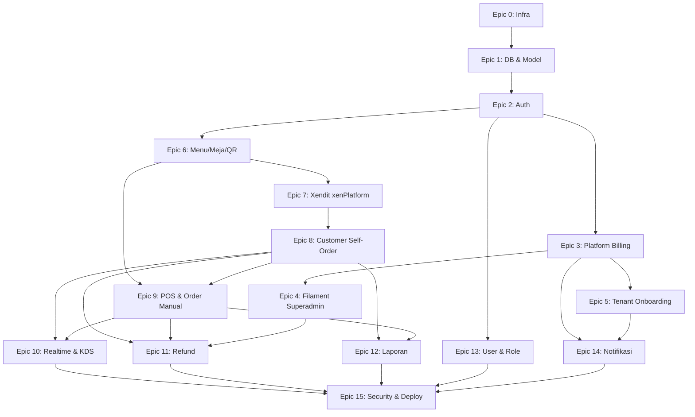

# Task Breakdown — Sistem POS Multi-Tenant SaaS

**Turunan dari:** PRD-POS-SaaS-v1.5, ARCHITECTURE-POS-SaaS-v1, ERD-POS-SaaS-v1, SCHEMA-POS-SaaS-v1, ACCEPTANCE-CRITERIA-POS-SaaS-v1
**Tujuan dokumen:** Memecah seluruh scope MVP menjadi Epic → Task teknis yang bisa langsung dikerjakan/di-assign, lengkap dengan urutan pengerjaan (dependency) dan referensi silang ke AC-code & tabel ERD terkait.

---

## Cara Membaca Dokumen Ini

- **Epic** = kelompok kerja besar (biasanya 1 modul/fitur).
- Setiap task ditandai **[Backend]**, **[Frontend-*]**, **[Filament]**, **[Infra]**, **[Integrasi]**, atau **[QA]**.
- Kolom **Ref** mengacu ke Acceptance Criteria (`AC-XXX-NN`) di ACCEPTANCE-CRITERIA-POS-SaaS-v1.md dan/atau tabel di SCHEMA-POS-SaaS-v1.md.
- Urutan Epic di dokumen ini **sudah disusun berdasarkan dependency**, bukan alfabetis — lihat juga peta dependency di bagian akhir.
- Epic 0–2 adalah fondasi wajib sebelum epic lain bisa jalan paralel.

---

## Epic 0 — Fondasi Infrastruktur & Repo

**Kenapa duluan:** semua development lain butuh environment yang jalan (DB, Redis, queue, auth) — tanpa ini tidak ada yang bisa di-test end-to-end.

| # | Task | Ref |
|---|---|---|
| 0.1 | [Infra] Setup repo Laravel + docker-compose (app, PostgreSQL, Redis, Reverb) untuk dev lokal | Arsitektur 3.7 |
| 0.2 | [Infra] Setup 3 repo/folder Vue 3 + Vite terpisah: Customer Order, POS+KDS, Owner Dashboard | Arsitektur 3.1 |
| 0.3 | [Infra] Setup Filament di project Laravel yang sama (bukan repo terpisah) | Arsitektur 3.1 |
| 0.4 | [Infra] Konfigurasi Nginx reverse proxy + wildcard subdomain lokal (`*.namaapp.test`) utk dev | Arsitektur 3.2 |
| 0.5 | [Infra] Setup GitHub Actions: pipeline test (PHPUnit) → build → deploy staging | Arsitektur 3.5, 3.7 |
| 0.6 | [Infra] Setup Sentry/Bugsnag utk backend & frontend | Arsitektur 3.5, 7 |
| 0.7 | [Infra] Setup S3-compatible object storage (DigitalOcean Spaces/MinIO dev) + Laravel Filesystem driver `s3` | Arsitektur 3.4 |
| 0.8 | [Infra] Provisioning VPS staging & production (Docker, Supervisor utk queue+Reverb) | Arsitektur 3.7 |
| 0.9 | [Infra] Setup automated daily backup PostgreSQL (retensi ≥7 hari) + backup pre-migration | Arsitektur 5 |
| 0.10 | [Infra] Setup 2 environment Xendit terpisah utk staging (sandbox) — Platform Billing & xenPlatform | Arsitektur 3.7 |

---

## Epic 1 — Database & Model Dasar

**Kenapa duluan:** hampir semua Epic butuh skema tabel final sebagai kontrak sebelum coding fitur.

| # | Task | Ref |
|---|---|---|
| 1.1 | [Backend] Buat migration untuk seluruh tabel platform & billing (`plans`, `tenants`, `subscriptions`, `billing_invoices`) | Schema §3 |
| 1.2 | [Backend] Buat migration tenant payment (`tenant_payment_accounts`, `settlement_logs`) — kolom rekening bank wajib pakai Laravel Encrypted Casting | Schema §4; Arsitektur §5 |
| 1.3 | [Backend] Buat migration outlet, meja, session (`outlets`, `tables`, `table_sessions`) | Schema §5 |
| 1.4 | [Backend] Buat migration menu & varian (`menu_categories`, `menu_items`, `menu_item_variant_groups`, `menu_item_variant_options`) — pastikan kolom `deleted_at` (soft delete) ada di keempatnya | Schema §6 |
| 1.5 | [Backend] Buat migration user, role, permission via `spatie/laravel-permission` (publish migration paket) | Schema §7 |
| 1.6 | [Backend] Buat migration order & transaksi (`orders`, `order_items`, `order_item_options`, `payments`, `refund_requests`) | Schema §8 |
| 1.7 | [Backend] Buat migration `audit_logs` | Schema §9 |
| 1.8 | [Backend] Buat seluruh Eloquent Model + relasi sesuai ERD (belongsTo/hasMany sesuai diagram) | ERD §1 |
| 1.9 | [Backend] Implementasi Global Scope `tenant_id` (via `stancl/tenancy` atau custom trait) di semua model bertenant | Arsitektur §5; Schema §11 |
| 1.10 | [Backend] Setup automated tenant-isolation test di pipeline CI (query tanpa scope harus gagal/di-flag) | Arsitektur §5, §8-1 |
| 1.11 | [Backend] Seeder: Plan Basic/Pro (harga dummy), role & permission default (superadmin/owner/kasir/kitchen_staff) | ERD §2A, §2F |
| 1.12 | [Backend] Setup index sesuai strategi di Schema §11 (composite index `tenant_id` + kolom lookup umum) | Schema §11 |

---

## Epic 2 — Autentikasi & Otorisasi

**Dependency:** Epic 1.

| # | Task | Ref |
|---|---|---|
| 2.1 | [Backend] Setup Laravel Sanctum (cookie-based utk SPA + token-based utk Fase 2) | Arsitektur §4 |
| 2.2 | [Backend] Endpoint login/logout + rate limit 5/email/5 menit | AC-AUTH-01 |
| 2.3 | [Backend] Endpoint forgot-password (token 60 menit, sekali pakai, rate limit 3/email/jam) + reset password | AC-AUTH-02 |
| 2.4 | [Backend] Validasi kebijakan password (min 8 karakter, huruf+angka) + hash bcrypt | Arsitektur §4 |
| 2.5 | [Backend] Implementasi 2FA (TOTP) wajib untuk role Owner & Superadmin | AC-AUTH-03 |
| 2.6 | [Backend] Idle timeout 8 jam (SPA) & token personal access 7 hari + endpoint `POST /api/auth/refresh` | Arsitektur §4 |
| 2.7 | [Backend] Session Superadmin (Filament): timeout ±2 jam, auto-logout idle 30 menit, 2FA wajib tanpa skip | AC-AUTH-04; Arsitektur §4 |
| 2.8 | [Backend] Middleware otorisasi berbasis role/permission (Spatie) per endpoint | AC-USR-02 |
| 2.9 | [Backend] CORS whitelist dinamis berdasarkan subdomain tenant aktif | Arsitektur §3.2 |
| 2.10 | [Frontend-Owner/POS] Halaman login + form 2FA (Owner) | AC-AUTH-03 |
| 2.11 | [QA] Test seluruh AC-AUTH-01 s/d 05 | AC-AUTH-* |

---

## Epic 3 — Platform Billing (Superadmin side) & Integrasi Xendit Platform Billing

**Dependency:** Epic 1, 2.

| # | Task | Ref |
|---|---|---|
| 3.1 | [Backend] Service class integrasi Xendit Platform Billing (create invoice, checkout link) — credential dari `.env` platform | PRD §13.1; Arsitektur §3.5 |
| 3.2 | [Backend] Endpoint `GET/POST /api/subscription/checkout` (dipakai bersama alur pilih-plan pasca-trial & upgrade) | PRD §2.4a |
| 3.3 | [Backend] Webhook `POST /webhook/xendit/platform-billing` — verifikasi `x-callback-token`, idempotent | AC-PAY-04, AC-PAY-05 |
| 3.4 | [Backend] Job scheduled: generate invoice recurring H-3 sebelum jatuh tempo, hitung basis outlet aktif | AC-BILL-06; PRD §2.4c |
| 3.5 | [Backend] Logic penagihan upgrade plan (harga penuh tier baru × outlet aktif, tanpa prorata) | AC-BILL-05, AC-BILL-07 |
| 3.6 | [Backend] State machine status `subscriptions`/`tenants`: trial→active→overdue→suspended→active/churned | AC-LIFE-01..04 |
| 3.7 | [Backend] Middleware enforcement akses per status tenant (full/banner/blocked sesuai tabel PRD §2.4b) | AC-LIFE-02, AC-LIFE-03 |
| 3.8 | [Backend] Job terjadwal: hapus permanen data tenant `churned` setelah 30 hari | AC-LIFE-04 |
| 3.9 | [Backend] Validasi backend limit plan (`max_tables_per_outlet`, `max_users_per_outlet`, `max_outlets`) saat create — return 422 jika lolos validasi FE | AC-BILL-04 |
| 3.10 | [Frontend-Owner] Modal "Upgrade ke Pro" (limit tercapai) + halaman "Pilih Paket Langganan" pasca-trial | AC-BILL-03, AC-BILL-04 |
| 3.11 | [Frontend-Owner] Banner countdown trial & banner peringatan tagihan (status overdue) | AC-BILL-01; PRD §2.4b |
| 3.12 | [QA] Test AC-BILL-01 s/d 07, AC-LIFE-01 s/d 04 | AC-BILL-*, AC-LIFE-* |

---

## Epic 4 — Superadmin Panel (Filament)

**Dependency:** Epic 1, 2, 3.

| # | Task | Ref |
|---|---|---|
| 4.1 | [Filament] Dashboard ringkasan platform (total tenant, growth) | AC-SA-01 |
| 4.2 | [Filament] Resource Tenants — list, detail, suspend/aktifkan manual (override) | AC-SA-02 |
| 4.3 | [Filament] Resource Plans & Subscriptions — CRUD plan (harga editable tanpa deploy ulang) | AC-SA-03 |
| 4.4 | [Filament] Resource Billing — monitoring invoice, override manual | PRD §3.2A |
| 4.5 | [Filament] Resource Platform Users — kelola tim internal + role/permission | AC-SA-05 |
| 4.6 | [Filament] Resource Audit Log — read-only, filter per tenant/actor/action | AC-SA-04 |
| 4.7 | [Filament] Halaman Settings platform-wide | PRD §3.2A |
| 4.8 | [Backend] Logging otomatis ke `audit_logs` setiap kali Superadmin akses data tenant utk support/debug | AC-SA-04; Arsitektur §5 |
| 4.9 | [QA] Test AC-SA-01 s/d 05 | AC-SA-* |

---

## Epic 5 — Tenant Onboarding (Self-Service Signup)

**Dependency:** Epic 1, 2, 3.

| # | Task | Ref |
|---|---|---|
| 5.1 | [Backend] Endpoint `POST /api/tenant/register` — rate limit 5/IP/jam + captcha | AC-ONB-01, AC-ONB-03 |
| 5.2 | [Backend] Endpoint `POST /api/tenant/check-subdomain` — validasi format & unik real-time, rate limit 30/IP/menit | AC-ONB-02 |
| 5.3 | [Backend] Reserved subdomain list di config; validasi 3–30 karakter `a-z0-9-` | Arsitektur §6 |
| 5.4 | [Backend] Auto-create saat register: 1 Tenant (`trial`, `trial_ends_at` +14 hari), 1 Outlet default, 1 User Owner | AC-ONB-01 |
| 5.5 | [Backend] Kirim email verifikasi async (tidak blocking login) | AC-ONB-04 |
| 5.6 | [Backend] Job reminder H-3 sebelum trial habis (trigger notifikasi Epic 14) | AC-BILL-01 |
| 5.7 | [Frontend-Landing] Halaman landing `namaapp.com/daftar` — form signup + validasi subdomain real-time | AC-ONB-01, AC-ONB-02 |
| 5.8 | [QA] Test AC-ONB-01 s/d 04 | AC-ONB-* |

---

## Epic 6 — Owner Dashboard: Outlet, Menu, Meja & QR

**Dependency:** Epic 1, 2.

| # | Task | Ref |
|---|---|---|
| 6.1 | [Backend] CRUD API kategori & item menu (per outlet, scope tenant) | AC-MENU-01 |
| 6.2 | [Backend] Upload foto menu — validasi maks 2MB (jpg/jpeg/png/webp), resize max 800px quality 80% sebelum ke S3 | Arsitektur §5 |
| 6.3 | [Backend] CRUD varian menu (grup + opsi), termasuk `is_required` utk single-choice | AC-MENU-05 |
| 6.4 | [Backend] Toggle stok habis/tersedia (quick toggle) + mode stok berbasis angka (`stock_qty`) berkurang otomatis saat order confirmed | AC-MENU-02, AC-MENU-03 |
| 6.5 | [Backend] Soft delete menu item/kategori/varian yang sudah pernah dipesan (tidak hard delete) | AC-MENU-04 |
| 6.6 | [Backend] CRUD meja (`tables`) + generate `qr_token` unik per outlet | AC-TBL-01 |
| 6.7 | [Backend] Generate file QR (PDF/PNG) → simpan ke S3, endpoint download | AC-TBL-01; Arsitektur §3.4 |
| 6.8 | [Backend] Regenerate/invalidate QR token (QR lama otomatis tidak valid) | AC-TBL-02 |
| 6.9 | [Backend] Setting `session_timeout_minutes` per meja (override) & `default_session_timeout_minutes` per outlet | AC-TBL-03 |
| 6.10 | [Backend] Endpoint tutup sesi meja manual (override) oleh Owner/Kasir | AC-TBL-04 |
| 6.11 | [Backend] Setting `min_order_amount` per outlet (default: tidak ada minimum) | AC-QR-04 |
| 6.12 | [Backend] Setting branding outlet (`branding_display_name`, `branding_logo_url`) — upload logo maks 1MB (+svg) | Arsitektur §5 |
| 6.13 | [Frontend-Owner] Halaman Menu: Kategori, Item Menu (form+upload foto), Stok | PRD §3.2B |
| 6.14 | [Frontend-Owner] Halaman Meja & QR Code — list, generate/download, regenerate | PRD §3.2B |
| 6.15 | [Frontend-Owner] Halaman Sesi Meja — lihat sesi aktif, tutup manual | PRD §3.2B |
| 6.16 | [Frontend-Owner] Halaman Pengaturan → Branding Outlet | PRD §3.2B |
| 6.17 | [QA] Test AC-MENU-01 s/d 06, AC-TBL-01 s/d 04 | AC-MENU-*, AC-TBL-* |

---

## Epic 7 — Integrasi Xendit xenPlatform (Payment Settlement Tenant)

**Dependency:** Epic 1, 2, 6.

| # | Task | Ref |
|---|---|---|
| 7.1 | [Backend] Service class integrasi Xendit xenPlatform (buat sub-account atas nama tenant) | PRD §13.1 |
| 7.2 | [Backend] Endpoint simpan data rekening bank tenant (`tenant_payment_accounts`) → panggil Xendit API → simpan `sub_account_id` | PRD §13.1 |
| 7.3 | [Backend] Sinkronisasi status verifikasi (`pending`/`verified`/`rejected`) dari Xendit, termasuk `rejection_reason` | AC-PAY-03 |
| 7.4 | [Backend] Validasi: nonaktifkan tombol publish QR self-order jika status sub-account belum `verified` | AC-PAY-02 |
| 7.5 | [Backend] Alur resubmit data rekening saat status `rejected` (tanpa batas percobaan) | AC-PAY-03 |
| 7.6 | [Frontend-Owner] Halaman Pengaturan Payment — form rekening bank, status verifikasi, tombol "Perbarui Data Rekening" | AC-PAY-02, AC-PAY-03 |
| 7.7 | [Frontend-Owner] Halaman riwayat settlement/pencairan dana | ERD §2B |
| 7.8 | [QA] Test AC-PAY-02, AC-PAY-03 | AC-PAY-* |

---

## Epic 8 — Customer Self-Order (QR Flow) & Pembayaran Order

**Dependency:** Epic 1, 2, 6, 7.

| # | Task | Ref |
|---|---|---|
| 8.1 | [Backend] Endpoint scan QR → create/lanjutkan `TableSession` aktif (short-lived signed token) | AC-QR-01; Arsitektur §4 |
| 8.2 | [Backend] Endpoint browse menu per outlet (kategori, item, status stok) — publik, scoped via token | PRD §3.1E |
| 8.3 | [Backend] Endpoint submit order — buat `Order` (`awaiting_payment`) + `OrderItem`/`OrderItemOption` dengan snapshot harga | AC-QR-02; ERD §2E |
| 8.4 | [Backend] Validasi stok real-time saat submit (edge case habis tepat saat submit → reject item spesifik) | AC-QR-03 |
| 8.5 | [Backend] Validasi `min_order_amount` di backend saat submit | AC-QR-04 |
| 8.6 | [Backend] Rate limit submit order 10/table_code/menit | AC-AUTH-05 |
| 8.7 | [Backend] Integrasi create transaksi Xendit + Split Rule ke `sub_account_id` tenant (1 route, tanpa platform fee) | AC-PAY-01; PRD §13.1 |
| 8.8 | [Backend] Webhook `POST /webhook/xendit/customer-order` — verifikasi `x-callback-token`, idempotent, identifikasi tenant via `external_id` prefix | AC-PAY-04, AC-PAY-05 |
| 8.9 | [Backend] Handle payment expired/failed → update status `Order`/`Payment` | AC-PAY-06 |
| 8.10 | [Backend] Order status state machine: `awaiting_payment→confirmed→preparing→ready→completed/cancelled` | AC-ORD-01 |
| 8.11 | [Backend] Job auto-expire order yang belum dibayar (timeout) | AC-ORD-02 |
| 8.12 | [Backend] Endpoint tambah pesanan baru selama `TableSession` masih aktif | AC-QR-06 |
| 8.13 | [Backend] Endpoint riwayat order — hanya dalam sesi kunjungan aktif saat ini | AC-QR-05 |
| 8.14 | [Backend] Job auto-close `TableSession` saat idle timeout | AC-QR-07 |
| 8.15 | [Backend] Cancel order otomatis jika sesi meja ditutup paksa (manual/timeout) di tengah order aktif | AC-ORD-05 |
| 8.16 | [Frontend-Customer] Halaman Menu (browse per kategori, foto, harga, stok) | PRD §3.2E |
| 8.17 | [Frontend-Customer] Halaman Keranjang + submit → redirect Xendit checkout | AC-QR-02 |
| 8.18 | [Frontend-Customer] Halaman Status Pesanan — tracking realtime (lihat Epic 10 utk WSS) | AC-QR-05 |
| 8.19 | [Frontend-Customer] Pesan blocking utk outlet tidak tersedia (tenant suspended) | PRD §2.4b |
| 8.20 | [QA] Test AC-QR-01 s/d 07, AC-ORD-01, AC-ORD-02, AC-ORD-05, AC-PAY-01, AC-PAY-04 s/d 06 | AC-QR-*, AC-ORD-*, AC-PAY-* |

---

## Epic 9 — POS Kasir & Order Manual

**Dependency:** Epic 1, 2, 6, 8.

| # | Task | Ref |
|---|---|---|
| 9.1 | [Backend] Endpoint create order manual (kasir) — dengan meja atau takeaway (`table_session_id` null) | AC-MAN-01, AC-MAN-02 |
| 9.2 | [Backend] Endpoint pembayaran cash → langsung `confirmed`, tetap create record `Payment` (`transaction_id = null`) | AC-MAN-03 |
| 9.3 | [Backend] Endpoint pembayaran non-cash order manual via Xendit (reuse service Epic 8.7) | AC-MAN-04 |
| 9.4 | [Backend] Validasi stok tetap berlaku utk order manual | AC-MAN-05 |
| 9.5 | [Backend] Endpoint void item saat status `confirmed`, catat `voided_by_user_id`/`voided_at` | AC-ORD-03 |
| 9.6 | [Backend] Blokir void/edit setelah status `preparing` | AC-ORD-04 |
| 9.7 | [Backend] Endpoint quick toggle stok habis/tersedia (dari POS, tanpa masuk menu management penuh) | PRD §3.1C |
| 9.8 | [Backend] Endpoint ringkasan penjualan shift berjalan | PRD §3.1C |
| 9.9 | [Frontend-POS] Layar Order Masuk — live order dari QR & manual, dikelompokkan per meja | AC-KDS-01 (pola sama) |
| 9.10 | [Frontend-POS] Form Order Manual (pilih meja/takeaway, tambah item+varian) | AC-MAN-01, AC-MAN-02 |
| 9.11 | [Frontend-POS] Layar proses pembayaran (cash/non-cash) + struk digital di layar | AC-MAN-03, AC-MAN-04 |
| 9.12 | [Frontend-POS] Halaman Meja — status & sesi, tombol tutup manual | AC-TBL-04 |
| 9.13 | [Frontend-POS] Riwayat Transaksi | PRD §3.2C |
| 9.14 | [QA] Test AC-MAN-01 s/d 05, AC-ORD-03, AC-ORD-04 | AC-MAN-*, AC-ORD-* |

---

## Epic 10 — Realtime (Reverb) & Kitchen Display System (KDS)

**Dependency:** Epic 1, 2, 8, 9.

| # | Task | Ref |
|---|---|---|
| 10.1 | [Backend] Setup Laravel Reverb + broadcasting auth callback (validasi `tenant_id`+`outlet_id`) | Arsitektur §3.6 |
| 10.2 | [Backend] Broadcast event `OrderCreated`, `OrderUpdated`, `OrderStatusUpdated` ke channel private per outlet | AC-KDS-01; Arsitektur §3.6 |
| 10.3 | [Backend] Channel customer (`private-tenant.{id}.table.{code}`) via short-lived signed token | AC-RT-04 |
| 10.4 | [Backend] Endpoint update status item/order oleh Kitchen Staff (`preparing`→`ready`) | AC-KDS-02 |
| 10.5 | [Backend] Polling endpoint ringan (fallback tiap 30 detik) — GET state order terkini | AC-RT-02 |
| 10.6 | [Frontend-POS/KDS/Customer] Integrasi Echo client + auto-reconnect (exponential backoff) | AC-RT-01, AC-RT-03 |
| 10.7 | [Frontend-POS/KDS/Customer] Indikator status koneksi (Live/Terputus/Reconnecting) | AC-RT-01 |
| 10.8 | [Frontend-POS/KDS/Customer] Fetch ulang state saat reconnect (1x) | AC-RT-03 |
| 10.9 | [Frontend-KDS] Layar Antrian Order — dikelompokkan per meja & waktu masuk, detail item+catatan | PRD §3.1D |
| 10.10 | [Frontend-KDS] Highlight visual SLA warning (order lama menunggu) | AC-KDS-03 |
| 10.11 | [Frontend-KDS] Halaman Riwayat Selesai (completed hari ini) | PRD §3.2D |
| 10.12 | [QA] Test AC-KDS-01 s/d 03, AC-RT-01 s/d 04 (termasuk test cross-tenant leakage) | AC-KDS-*, AC-RT-* |

---

## Epic 11 — Refund

**Dependency:** Epic 1, 2, 4, 8, 9.

| # | Task | Ref |
|---|---|---|
| 11.1 | [Backend] Endpoint ajukan refund request (kasir/owner) — rate limit 3/order/jam | AC-REF-01 |
| 11.2 | [Backend] Endpoint approval/reject oleh Superadmin | AC-REF-02, AC-REF-05 |
| 11.3 | [Backend] Proses refund via Xendit API utk order non-cash, catat `SettlementLog` (`refund_deduction`) | AC-REF-03 |
| 11.4 | [Backend] Alur refund order cash (tanpa Xendit — proses manual/pencatatan) | AC-REF-04 |
| 11.5 | [Frontend-POS/Owner] Form pengajuan refund | AC-REF-01 |
| 11.6 | [Filament] Halaman review & approve/reject refund request | AC-REF-02 |
| 11.7 | [QA] Test AC-REF-01 s/d 05 | AC-REF-* |

---

## Epic 12 — Laporan & Analytics

**Dependency:** Epic 8, 9.

| # | Task | Ref |
|---|---|---|
| 12.1 | [Backend] Endpoint laporan penjualan (harian/mingguan/bulanan) per outlet | AC-RPT-01 |
| 12.2 | [Backend] Endpoint menu terlaris & jam ramai (peak hours) | AC-RPT-02 |
| 12.3 | [Backend] Endpoint ringkasan pendapatan per metode pembayaran | AC-RPT-03 |
| 12.4 | [Backend] Export laporan CSV/PDF | AC-RPT-04 |
| 12.5 | [Frontend-Owner] Halaman Laporan: Penjualan, Menu Terlaris, Jam Ramai + chart | PRD §3.2B |
| 12.6 | [Frontend-Owner] Dashboard ringkasan penjualan hari ini + grafik singkat | PRD §3.2B |
| 12.7 | [QA] Test AC-RPT-01 s/d 04 | AC-RPT-* |

---

## Epic 13 — Manajemen User & Role (Tenant-side)

**Dependency:** Epic 1, 2.

| # | Task | Ref |
|---|---|---|
| 13.1 | [Backend] Endpoint invite user baru (kasir/kitchen staff) — validasi limit `max_users_per_outlet` | AC-USR-01 |
| 13.2 | [Backend] Endpoint assign role/permission per user (scope tenant) | AC-USR-02 |
| 13.3 | [Backend] Validasi scope: Owner tidak terikat 1 outlet, staff (kasir/kitchen) terikat `outlet_id` | AC-USR-03 |
| 13.4 | [Frontend-Owner] Halaman Staff — invite, kelola user, atur role | PRD §3.2B |
| 13.5 | [QA] Test AC-USR-01 s/d 03 | AC-USR-* |

---

## Epic 14 — Notifikasi (WA + Email)

**Dependency:** Epic 0, 3, 5.

| # | Task | Ref |
|---|---|---|
| 14.1 | [Infra] Deploy OpenWA sebagai service Docker terpisah di VPS + 1 nomor WA dedicated | Arsitektur §3.5; PRD §9.6 |
| 14.2 | [Backend] Service internal call ke OpenWA REST API dari Queue Worker (tidak diekspos publik) | Arsitektur §3.3 |
| 14.3 | [Backend] Setup email service transaksional (SMTP) — verifikasi akun, reset password, invoice | Arsitektur §3.5 |
| 14.4 | [Backend] Job kirim notifikasi H-3 trial habis, masuk `overdue`, `suspended` — 2 kanal (WA+Email), hanya ke owner | AC-BILL-01; PRD §2.4b |
| 14.5 | [QA] Test pengiriman notifikasi di semua trigger status lifecycle | AC-BILL-01, AC-LIFE-* |

---

## Epic 15 — Keamanan, Observability & Deployment Akhir

**Dependency:** semua epic fungsional selesai/hampir selesai; berjalan paralel sejak awal untuk sebagian task.

| # | Task | Ref |
|---|---|---|
| 15.1 | [Backend] Rate limiting seluruh endpoint sesuai tabel Arsitektur §5 (register, check-subdomain, submit order, login, refund-request) | Arsitektur §5 |
| 15.2 | [Backend] Audit trail lengkap: void item, suspend tenant, approve refund, akses data tenant oleh Superadmin | ERD §2F |
| 15.3 | [Backend] Retensi data: order/payment ≥1 tahun, tenant churned 30 hari lalu hapus permanen (link ke 3.8) | Arsitektur §5 |
| 15.4 | [Backend] Timezone: simpan UTC, konversi ke `Outlet.timezone` (default `Asia/Jakarta`) saat tampil/hitung jatuh tempo | Arsitektur §6 |
| 15.5 | [Backend] Format angka IDR sebagai integer, formatting `Rp XX.XXX` di frontend | Arsitektur §6 |
| 15.6 | [Infra] Alerting otomatis jika Reverb/Queue Worker down | Arsitektur §7 |
| 15.7 | [Infra] Load test halaman Customer Order (target <2 detik di 4G) | Arsitektur §7 |
| 15.8 | [Infra] Uji kompatibilitas browser: Android WebView (in-app WA), Safari iOS 2 versi terakhir (Customer); desktop modern (POS/Owner/KDS) | Arsitektur §3.1 |
| 15.9 | [QA] Full regression seluruh AC + security review (webhook signature, cross-tenant leakage, rate limit) | Semua AC |
| 15.10 | [Infra] Deploy production + smoke test end-to-end (signup → order → payment → KDS → laporan) | — |

---

## Peta Dependency Antar-Epic

---

## Saran Pengelompokan Fase/Sprint

| Fase | Isi | Alasan |
|---|---|---|
| **Fase 1 — Fondasi** | Epic 0, 1, 2 | Tidak ada fitur yang bisa dites tanpa ini; kerjakan berurutan, bukan paralel |
| **Fase 2 — Platform & Onboarding** | Epic 3, 4, 5 | Menutup jalur bisnis platform (billing, superadmin, signup) sebelum masuk fitur operasional resto |
| **Fase 3 — Operasional Inti (paralel)** | Epic 6, 7, 13 | Bisa dikerjakan paralel oleh tim berbeda setelah Fase 1 selesai; semua jadi prasyarat Fase 4 |
| **Fase 4 — Transaksi & Realtime** | Epic 8, 9, 10 | Inti value proposition produk (self-order QR + realtime); butuh Fase 3 selesai penuh |
| **Fase 5 — Penyempurnaan Operasional** | Epic 11, 12, 14 | Melengkapi alur bisnis (refund, laporan, notifikasi); bisa mulai paralel begitu Epic 8–9 stabil |
| **Fase 6 — Pengerasan & Rilis** | Epic 15 | Security review, load test, deploy production; berjalan sebagian sejak awal tapi difinalisasi terakhir |

**Catatan:** dokumen ini tidak memberi estimasi waktu/story point karena itu bergantung ukuran tim — gunakan jumlah task per Epic sebagai proksi kasar ukuran relatif saat sizing sprint.
